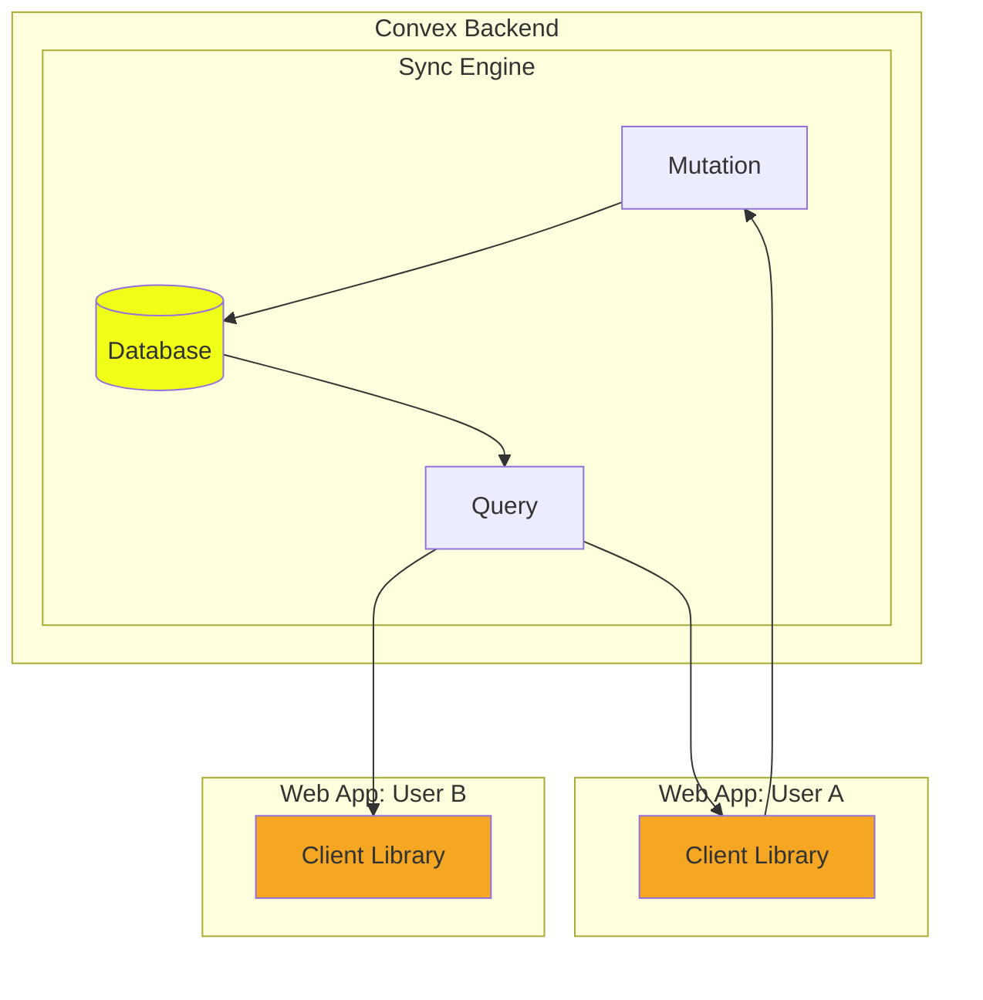

# Convex 개요

Backend-as-a-Service로, JWT 방식으로 통신하여 사용할 수 있다. 서버리스/비동기처리가 기본인 서비스이기 때문에 Supabase등의 대안보다 관리가 용이하다.

# 구조


## Database:
Document-Relation DB라는, DocDB와 RDB가 혼합된 형태의 DB를 사용한다. 즉, RDB 테이블에 JSON-like한 구조의 데이터를 저장한다는 말.  
`_id`는 자동으로 할당되는데, 이것들 통해 RDB처럼 관계를 생성할 수 있으면서도 DocDB의 장점을 살리고 싶었던 듯.

```typescript
// messages 테이블의 문서들
{
  _id: "abc123",  // 자동 생성
  user: "철수",
  body: "안녕하세요"
}

{
  _id: "def456",
  user: "영희",
  body: "반갑습니다",
  replyTo: "abc123"  // 다른 문서의 _id로 관계 생성!
}
```

## Mutation Functions
클라이언트는 데이터베이스에 변경(Mutation)을 요청할 수 있다.  
클라이언트에서 다음과 같이 요청을 하면:
```typescript
// src/App.tsx
import { useMutation } from "convex/react";
import { api } from "../convex/_generated/api";

export default function App() {
  const sendMessage = useMutation(api.chat.sendMessage);
  
  await sendMessage({ 
    user: "철수", 
    body: "안녕하세요" 
  });
}
```
backend에서는 다음과 같은 mutation 함수가 작동할 수 있다:
```typescript
// convex/chat.ts
import { mutation } from "./_generated/server";
import { v } from "convex/values";

export const sendMessage = mutation({
  args: {
    user: v.string(),
    body: v.string(),
  },
  handler: async (ctx, args) => {
    await ctx.db.insert("messages", {
      user: args.user,
      body: args.body,
    });
  },
});
```
(아쉽게도 Backend 코드도 Typescript만 지원하는 중.)  
하나의 mutation은 하나의 transaction으로, 함수 안의 모든 DB 변경이 하나의 단위로 실행됨. (전부 성공하거나 전부 실패, 중간 상태 없음)


## Query Functions
DB로부터 읽기 기능만 수행 가능한 함수이다.
```typescript
export const getMessages = query({
  handler: async (ctx) => {     // 읽기만 하므로 전달할게 없으니 `args`는 없다.
    // 오직 읽기만 가능
    const messages = await ctx.db.query("messages").collect();
    return messages;
    
    // ctx.db.insert(...) -> 에러 발생 ❌
  },
});
```
여러 클라이언트가 한 쿼리를 동시에 구독할 수 있다. 데이터 변경을 금지하여 일관성 유지.

## Client Library
클라이언트의 Client Library는 Query를 "구독" 할 수 있다.  
(`const messages = useQuery(api.chat.getMessages);`)

**동작 방식:**
1. `useQuery`를 호출하면 WebSocket 연결 생성
2. 백엔드의 `getMessages` 쿼리를 실행
3. 결과를 `messages` 변수에 저장
4. **자동 업데이트**: DB가 변경되면 자동으로 다시 실행!

**WebSocket 사용 이유:**
- HTTP는 클라이언트가 요청해야만 응답받음
- WebSocket은 서버가 먼저 클라이언트에게 푸시 가능
- 실시간 업데이트에 최적!