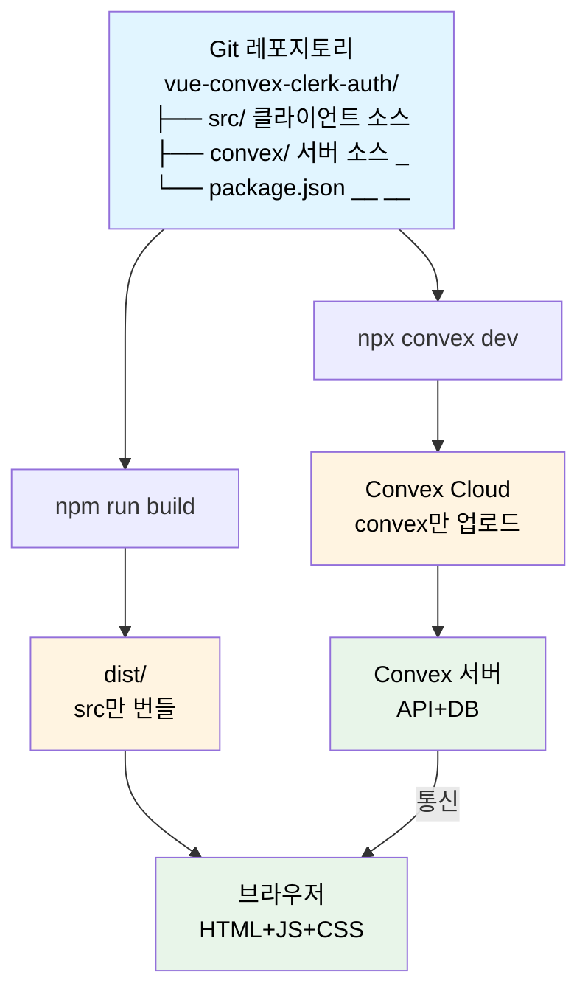
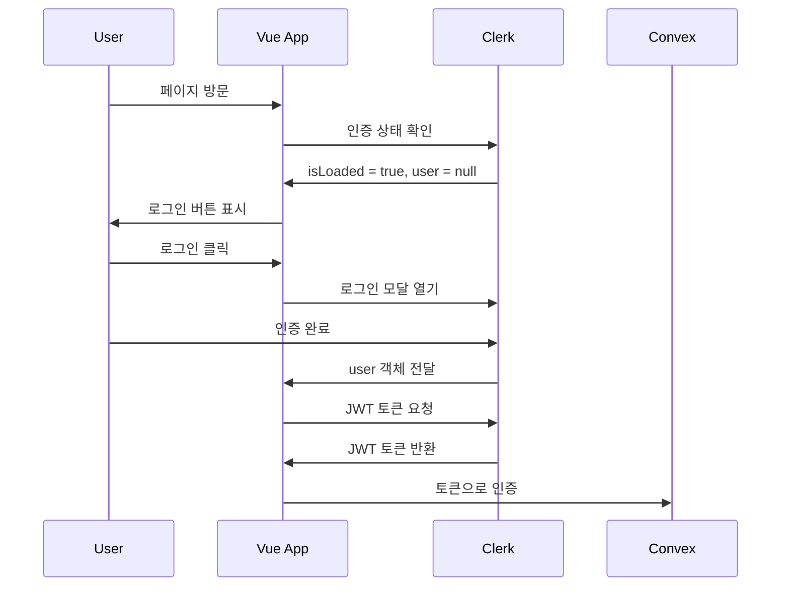

Vue로 작성된 프론트엔드 코드에 완성도 높은 서버리스 Backend-as-a-Service인 Convex, 그리고 Authentification 관리 SaaS인 Clerk를 연동하여, 실제로 서비스 할 수 있는 웹앱을 구현해보자.

# 모노레포로 관리 가능
서버리스 백엔드를 사용하기 때문에 별도의 클라우드 VM을 개통할 필요가 없고 단일 레포에서 코드 작업을 해도 무방하다.
레포는 프론트와 백엔드 코드 모두 포함하고 있지만, 빌드 시에는 서로 격리됨.

- `src`에 Vue로 작성된 클라이언트 코드
- `convex`에 백엔드 configuration과 DB 스킴 정의, Mutation/Query/Action 함수 작성


# 환경설정

`.env`에 다음 항목들을 추가하자.

### VITE_CLERK_PUBLISHABLE_KEY
Clerk dashboard -> 해당하는 application 선택 -> Overview에서 Vue 선택 -> 3번 항목(Set your Clerk API keys)에서 확인 가능.

### VITE_CONVEX_URL

프로젝트 이름: Convex 콘솔 상단의 초록색 영역에 적혀있음. ex) `goat-ocelot-727`

### CLERK_JWT_ISSUER_DOMAIN
 
`https://dashboard.convex.dev/d/{프로젝트 이름}/settings/environment-variables?var=CLERK_JWT_ISSUER_DOMAIN`에서 설정

```bash
# Clerk 설정
VITE_CLERK_PUBLISHABLE_KEY=pk_test_your_key_here
# Convex 설정
VITE_CONVEX_URL=https://{프로젝트 이름}.convex.cloud
# Convex 백엔드용
CLERK_JWT_ISSUER_DOMAIN=https://clerk.your-domain.com
```

이 설정을 완료한 후 `npx convex dev`를 실행하여 연동.


# 클라이언트 훑어보기

## `main.ts`

```typescript
// 1. Vue 앱 생성
const app = createApp(App);

// 2. Clerk 인증 플러그인 설정
app.use(clerkPlugin, {
  publishableKey: import.meta.env.VITE_CLERK_PUBLISHABLE_KEY,
});

// 3. Convex 백엔드 플러그인 설정
app.use(convexVue, {
  url: import.meta.env.VITE_CONVEX_URL,
});

// 4. DOM에 마운트
app.mount("#app");
```
1. `app`을 생성
2. 플러그인을 use할 수 있게 key 입력

## `App.vue`
프론트엔드 root 컴포넌트.

**컴포넌트 구조**:
```
App.vue
├── Loading State (isLoaded === false)
│   └── LoadingSpinner
└── Main Content (isLoaded === true)    # 로딩완료시
    ├── Header
    │   ├── Title
    │   └── Auth Buttons (UserButton or SignInButton)
    └── Main
        ├── ConvexProvider (if user)
        │   └── UserProfile
        └── Sign In Message (if no user)
```

## Clerk 통합하기


Clerk는 Authentification을 담당하는 SaaS 서비스이다. Convex와 무리없이 연동됨.  
`App.vue`의 코드를 단순히 표현하면:
```typescript
<script setup>
import { 
  SignInButton,  // 로그인 버튼
  UserButton,    // 사용자 프로필 버튼
  useUser        // 사용자 상태 훅
} from "@clerk/vue";

const { user, isLoaded } = useUser();   // 유저 로그인 상태 객체
</script>

<template>
  <UserButton v-if="user" />  // 로그인을 한 경우
  <SignInButton v-else />   // 로그인을 하지 않은 경우
</template>
```
로그인 여부에 따라 `UserButton`, `SignInButton`라는 서로 다른 컴포넌트를 표시한다.


# Convex 백엔드 설정

### `schema.ts` - 데이터베이스 스키마
이 파일에선 데이터의 스키마를 정의할 수 있다.

```typescript
import { defineSchema, defineTable } from "convex/server";
import { v } from "convex/values";

export default defineSchema({
  /**
   * 인증된 사용자 정보를 저장하는 Users 테이블.
   * 이 테이블은 Clerk 인증과 동기화된 사용자 프로필을 저장합니다.
   * 각 사용자는 고유한 Clerk ID를 가지며 연결된 메시지를 가질 수 있습니다.
   */
  users: defineTable({
    clerkId: v.string(),    // Clerk 인증 서비스의 고유 식별자
    email: v.string(),      // 사용자의 이메일 주소
    name: v.optional(v.string()),   // 사용자의 표시 이름
    createdAt: v.number(),          // 사용자가 처음 생성된 타임스탬프
  }).index("by_clerk_id", ["clerkId"]),

  /**
   * 사용자 생성 콘텐츠를 저장하는 Messages 테이블.
   * 이 테이블은 인증된 사용자가 생성한 메시지를 저장합니다.
   * 각 메시지는 userId 필드를 통해 사용자와 연결됩니다.
   */
  messages: defineTable({
    text: v.string(),       // 메시지 내용 텍스트
    userId: v.id("users"),  // 메시지를 생성한 사용자에 대한 참조
    createdAt: v.number(),  // 메시지가 생성된 타임스탬프
  }),
});
```
`defineScema`의 각 요소로 `defineTable`로 users와 messages 테이블을 각각 정의했다.  
- string, number 뿐만 아니라 JSON 형태로 스킴을 정의할 수도 있다. RDB + DocDB 하이브리드
- `_id`라는 Convex 고유 특수타입의 id가 자동으로 할당됨. -> RDB처럼 쓰는 데에 사용
- `by_clerk_id`를 통해 `clerkId` 기준으로 해시 검색이 가능하게 만듦.

### 


# 정리: 인증 흐름




# 참고자료
Vue.js + Convex Backend with Clerk Auth 🔑 Full-Stack Tutorial - by. Aron Saunders  
[YouTube](https://www.youtube.com/watch?v=q4orGOuD_mI)  
[GitHub](https://github.com/aaronksaunders/vue-convex-clerk-auth)