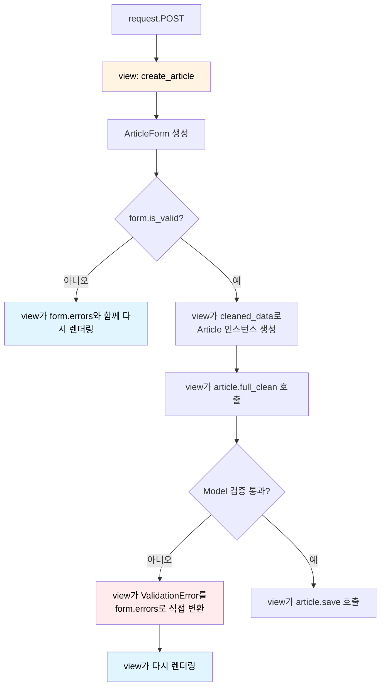
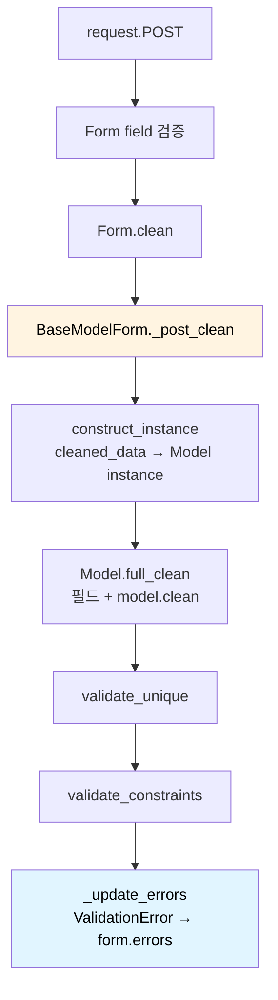

> 이전 글 [Vibe Coding을 위한 디자인 패턴 - 중재자](/posts/design-pattern/designpattern-mediator/)를 읽었다는 가정 하에 쓴다.

Mediator를 배울 때 흔히 채팅방이나 UI 대화상자를 예로 든다. 실무에서는 좀 더 조용한 모습으로 나타난다. 여러 객체가 직접 서로를 호출하지 않게 하고, **순서·예외 처리·결과 변환을 한곳에서 조율하는 객체**가 바로 Mediator다.

Django의 `ModelForm`은 그 좋은 사례다. 사용자가 입력한 데이터를 모델 인스턴스에 반영하고 검증할 때, Form 필드·Model·Validator·오류 표현이 각자 알아서 협력하게 두지 않는다. `BaseModelForm`이 전체 검증 여정을 조율한다.

소스: [django/forms/models.py](https://github.com/django/django/blob/main/django/forms/models.py)

---

## Django와 ModelForm이 뭔지 3줄

Django는 Python 웹 프레임워크다. `Model`은 데이터베이스 테이블과 그 데이터 규칙을 표현하고, `Form`은 HTTP 요청으로 들어온 문자열을 입력 필드 단위로 정리하고 검증한다.

`ModelForm`은 둘을 연결한다. 예를 들어 `Article` 모델이 있으면 제목·본문용 Form 필드를 만들어 주고, 검증을 통과한 값을 `Article` 인스턴스에 반영해 저장까지 이어 갈 수 있다.

```python
class Article(models.Model):
    title = models.CharField(max_length=100, unique=True)
    body = models.TextField()

class ArticleForm(forms.ModelForm):
    class Meta:
        model = Article
        fields = ["title", "body"]
```

여기서 “제목이 비어 있나?”, “길이가 너무 긴가?”, “같은 제목이 이미 있나?”, “모델의 제약 조건을 만족하나?”는 서로 다른 층의 질문이다. 그러나 사용자는 `form.is_valid()` 한 번으로 일관된 `form.errors`를 받고 싶다.

## 문제: 검증 주체가 서로 직접 협력하면 무엇이 꼬이나

검증을 직접 엮는다면 view는 이런 순서와 예외 타입을 모두 알아야 한다.

```python
# 개념적인 나쁜 예 — 실제 Django 권장 코드가 아님
def create_article(request):
    form = ArticleForm(request.POST)

    if not form.is_valid():              # Form field 검증
        return render(request, "new.html", {"form": form})

    article = Article(**form.cleaned_data)
    try:
        article.full_clean()             # Model 검증, 제약 조건, 중복 검사
    except ValidationError as error:
        # 어느 필드의 오류인지, Form 오류로 어떻게 바꿀지 view가 알아야 한다.
        for field, messages in error.message_dict.items():
            for message in messages:
                form.add_error(field, message)
        return render(request, "new.html", {"form": form})

    article.save()
```

흐름으로 보면, 검증 주체 사이의 조율 책임이 전부 view에 몰린다.



이 방식에는 세 가지 문제가 있다.

1. Form이 이미 실패한 필드를 Model이 다시 검증할 수 있다.
2. `ValidationError`를 사용자가 볼 `form.errors` 구조로 바꾸는 규칙이 view마다 반복된다.
3. 필드 검증, 모델 검증, unique 검사, constraint 검사의 **순서**가 호출하는 쪽에 새어 나온다.

특히 순서는 구현 세부 사항이 아니다. 모델 인스턴스를 먼저 만들지 않으면 모델 검증을 할 수 없고, 이미 형식 오류가 난 필드는 중복 검사에서 다시 문제 삼지 않는 편이 올바른 오류 메시지를 만든다.

## 해법: `BaseModelForm._post_clean()`이 검증 여정을 지휘한다

`form.is_valid()`는 내부적으로 `full_clean()`을 호출한다. 그 흐름에서 일반 Form이 필드와 Form 자체를 정리한 뒤, `ModelForm`이 오버라이드한 `_post_clean()`이 실행된다.



`_post_clean()`은 “검증을 직접 구현하는 거대한 함수”라기보다, 이미 존재하는 검증자들을 **알맞은 순서로 호출하고 결과를 번역하는 조정자**다. 현재 Django 소스를 이해하기 쉽게 줄이면 다음과 같은 구조다.

```python
# django/forms/models.py의 흐름을 설명용으로 단순화
def _post_clean(self):
    exclude = self._get_validation_exclusions()
    self.instance = construct_instance(self, self.instance, ...)

    try:
        self.instance.full_clean(
            exclude=exclude,
            validate_unique=False,
            validate_constraints=False,
        )
    except ValidationError as error:
        self._update_errors(error)

    if self._validate_unique:
        self.validate_unique()
    if self._validate_constraints:
        self.validate_constraints()
```

여기서 `False` 두 개가 핵심이다. `Model.full_clean()`도 unique·constraint 검사를 할 수 있지만, `ModelForm`은 이 둘을 별도 단계로 미룬다. 그래야 Form에 없는 필드와 inline foreign key처럼 **검사마다 제외 기준이 다른 경우**를 올바르게 처리하고, 발생한 오류도 같은 방식으로 Form에 담을 수 있다.

## `_get_validation_exclusions()` — 모두에게 같은 입력을 주지 않는다

중재자는 무조건 모든 객체를 호출하는 브로드캐스터가 아니다. 누구에게 어떤 정보를 넘길지 결정한다. `_get_validation_exclusions()`이 그 역할을 한다.

이 메서드는 모델 필드 중에서 다음과 같은 필드를 검증 대상에서 뺀다.

- Form에 아예 노출하지 않은 모델 필드
- `Meta.fields` 또는 `Meta.exclude`로 제외한 필드
- Form 필드 검증에서 이미 오류가 난 필드
- Form에서는 선택 사항이지만 Model에서는 빈 값을 허용하지 않는 특정 필드

예를 들어 `title`의 길이가 이미 Form 필드 검증에서 실패했다면, Model에게 같은 `title`을 다시 검증해 또 다른 오류를 얹게 할 이유가 없다. **Form의 현재 상태를 읽어 Model 검증의 입력 범위를 조정하는 것**이 ModelForm의 Mediator다운 부분이다.

단, inline foreign key는 기본 모델 검증에서는 제외하되 unique 검사에는 포함해야 한다. 그래서 `_post_clean()`은 이 필드를 별도로 다룬다. 중재자가 존재하는 이유는 바로 이런 “A 단계에는 빼되 B 단계에는 넣는다” 같은 협력 규칙을 각 객체 밖에 두기 위해서다.

## `construct_instance()` — Form 데이터를 Model로 넘기는 경계

Form의 `cleaned_data`는 검증된 입력값 딕셔너리이고, Model 검증은 모델 인스턴스에서 실행된다. `construct_instance()`는 둘 사이의 번역을 담당한다.

```python
# 개념적으로는 이런 작업이다.
article = form.instance
article.title = form.cleaned_data["title"]
article.body = form.cleaned_data["body"]
```

실제 구현은 파일 입력, 제외 필드, many-to-many 관계 등을 처리하므로 더 복잡하다. 중요한 것은 ModelForm이 이 변환을 호출해 **Model이 Form을 알 필요 없게** 만든다는 점이다. `Article` 모델은 HTTP form이나 `cleaned_data`의 존재를 모른 채 자신의 `full_clean()`만 제공한다.

## `full_clean()`과 `validate_unique()`를 분리하는 이유

`_post_clean()`은 Model에 모든 일을 맡기지 않는다. 먼저 `full_clean()`에서 모델 필드와 `model.clean()`을 실행하고, 그 뒤 unique 검사와 constraint 검사를 각각 실행한다.

```python
# 설명용 호출 관계
ModelForm._post_clean()
    ├─ instance.full_clean(..., validate_unique=False,
    │                      validate_constraints=False)
    ├─ instance.validate_unique(exclude=...)
    └─ instance.validate_constraints(exclude=...)
```

이 분리 덕분에 `ModelForm.clean()`은 unique/constraint 검사를 켤지 결정할 수 있다. Django의 기본 `BaseModelForm.clean()`은 두 플래그를 `True`로 바꾼다. 따라서 커스텀 `clean()`을 오버라이드할 때 `super().clean()`을 호출하지 않으면 이 검사들이 실행되지 않을 수 있다.

```python
class ArticleForm(forms.ModelForm):
    def clean(self):
        cleaned_data = super().clean()  # unique/constraint 검사 활성화
        if cleaned_data.get("title") == "공지":
            self.add_error("title", "제목으로 '공지'는 사용할 수 없습니다.")
        return cleaned_data
```

이것은 단순한 관례가 아니다. `clean()`은 사용자 정의 Form 규칙을 추가하면서도, 이후 Model 검증 파이프라인을 계속 진행하겠다는 **중재자와의 약속**이다.

## `_update_errors()` — 예외를 UI가 이해하는 언어로 번역한다

Model은 검증 실패를 `ValidationError`로 표현한다. 그러나 템플릿은 보통 `form.errors["title"]`처럼 Form 오류를 읽는다. `BaseModelForm._update_errors()`는 그 사이를 번역한다.

```python
# 개념적인 역할
try:
    instance.validate_unique(exclude=exclude)
except ValidationError as error:
    form.add_error(None, error)  # 필드별 오류를 form.errors에 병합
```

실제 `_update_errors()`는 Form의 `Meta.error_messages`나 각 Form field의 `error_messages`를 우선 적용한 뒤, non-field error까지 포함해 오류를 병합한다. 그래서 Model은 오류의 의미와 코드만 제공하고, **어떤 문구로 어떤 Form 필드에 보여 줄지**는 ModelForm이 통제한다.

이 지점에서 ModelForm은 Adapter처럼도 보인다. 하지만 본질은 단순한 예외 타입 변환이 아니다. 인스턴스 생성 → Model 검증 → unique 검사 → constraint 검사라는 **여러 협력 단계를 지휘하는 과정 중 하나로 오류 변환이 들어간다**는 점에서 Mediator에 더 가깝다.

## 패턴 용어로 역할을 매핑하면

교과서 Mediator는 `ChatRoom.notify()`처럼 한 메서드로 메시지를 중계하는 모습을 보인다. Django에는 그와 똑같은 모양의 `notify()`가 없다. 대신 검증 라이프사이클의 훅들이 중재자 역할을 나눠 가진다.

- **ConcreteMediator** → `BaseModelForm`, 특히 `_post_clean()`과 관련 헬퍼
- **Colleague: 입력 검증** → `Form` field와 `Form.clean()`
- **Colleague: 도메인 규칙** → Model의 field validator와 `Model.clean()`
- **Colleague: 데이터 무결성 검사** → `Model.validate_unique()`, `Model.validate_constraints()`
- **공유 결과 표현** → `form.errors`

Form field, Model, validator가 서로를 호출하지 않는다는 말은 절대적으로 완전한 단절이라는 뜻은 아니다. 예를 들어 ModelForm은 Model의 메타데이터를 읽어 Form 필드를 만든다. 여기서 말하는 Mediator-like 구조는 **런타임 검증 흐름에서 각각의 검증 주체가 다음 주체의 호출 순서와 오류 표현을 결정하지 않는다**는 뜻이다. 그 결정은 `BaseModelForm`에 모여 있다.

## 이것은 God Object인가?

ModelForm은 Form·Model·Validator·오류 표현을 모두 알아야 하므로 중앙 집중적인 객체다. 따라서 “결합을 없앤다”기보다, 그 결합을 **검증 경계에 의도적으로 모은다**고 보는 편이 정확하다.

그렇다고 아무 검증이나 `ModelForm.clean()`에 넣으면 곧 God Object가 된다. 책임의 경계를 이렇게 잡는 것이 좋다.

- 형식·입력 UX 규칙 → Form field 또는 `Form.clean_<field>()`
- 여러 Form 입력값의 관계 → `Form.clean()`
- HTTP와 무관한 도메인 규칙 → `Model.clean()` 또는 별도 도메인 서비스
- DB 수준의 무결성 → `UniqueConstraint`, `CheckConstraint` 같은 모델 제약 조건
- 이 규칙들을 어떤 순서로 실행하고 오류를 어디에 보여 줄지 → `ModelForm`

예를 들어 “비밀번호 확인 값이 비밀번호와 같은가?”는 화면 입력의 문제이므로 Form에 두는 편이 자연스럽다. 반면 “예약 종료 시각은 시작 시각보다 뒤여야 한다”는 API·관리 화면·배치 작업에서도 지켜야 하는 도메인 규칙이므로 Model이나 DB constraint 쪽이 더 적합하다.

## 한 줄 정리

> Django `ModelForm`은 검증을 전부 직접 수행하는 만능 객체가 아니다. Form·Model·Validator가 각자 가진 검증 능력은 유지한 채, **무엇을 제외하고 어떤 순서로 실행하며 오류를 어디에 모을지**를 `BaseModelForm._post_clean()`에 집중시킨 Mediator-like 구조다.
