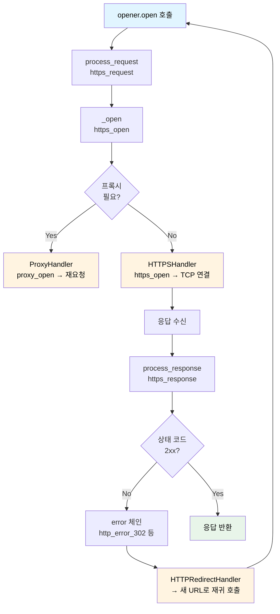

> 이전 글 [Vibe Coding을 위한 디자인 패턴 - 책임 연쇄](/posts/design-pattern/designpattern-chain-of-responsibility/)를 읽었다는 가정 하에 쓴다.

## urllib.request가 뭔지 3줄

`urllib.request`는 Python 표준 라이브러리에 포함된 HTTP 클라이언트 모듈이다.  
`requests` 같은 외부 라이브러리 없이도 URL을 열고, 리다이렉트를 따라가고, 인증을 처리할 수 있다.  
CPython 소스에서 `Lib/urllib/request.py` 한 파일에 약 2100줄로 구현되어 있다.

---

## 문제: "HTTP 요청 하나를 처리하는 데 얼마나 많은 단계가 필요한가"

`urllib.request.urlopen("https://example.com")` 한 줄을 실행하면 내부에서 이런 일들이 일어난다.

```
1. 프록시 설정이 있으면 요청을 프록시로 라우팅
2. 실제 TCP 연결을 맺고 HTTP 요청 전송
3. 응답이 301/302 리다이렉트면 새 URL로 다시 요청
4. 응답이 401 Unauthorized면 인증 헤더를 붙여 재시도
5. 응답이 4xx/5xx면 HTTPError로 변환
6. 최종 응답을 file-like 객체로 포장해서 반환
```

이걸 하나의 거대한 함수에 다 넣을 수도 있다. 하지만 요구사항은 끝없이 바뀐다. HTTPS가 추가되고, 쿠키 지원이 필요해지고, FTP도 처리해야 하고, 커스텀 인증 방식도 끼워 넣어야 한다.

CPython은 이 문제를 **책임 연쇄 패턴**으로 풀었다.

---

## 해법: OpenerDirector + BaseHandler 체인

`urllib.request`의 핵심 구조는 두 클래스다.

```
OpenerDirector (디렉터)
  └── BaseHandler 목록 (핸들러 체인)
       ├── ProxyHandler          ← 프록시 처리
       ├── HTTPHandler           ← HTTP 연결
       ├── HTTPSHandler          ← HTTPS 연결
       ├── HTTPRedirectHandler   ← 301/302 리다이렉트
       ├── HTTPCookieProcessor   ← 쿠키 처리
       ├── HTTPBasicAuthHandler  ← HTTP Basic 인증
       ├── HTTPErrorProcessor    ← 에러 응답 처리
       └── UnknownHandler        ← 처리 불가 시 예외
```

`build_opener()`가 이 체인을 조립하고, `opener.open(url)`이 요청을 체인에 흘려보낸다.

```python
# urllib/request.py
def build_opener(*handlers):
    opener = OpenerDirector()
    default_classes = [ProxyHandler, UnknownHandler, HTTPHandler,
                       HTTPDefaultErrorHandler, HTTPRedirectHandler,
                       FTPHandler, FileHandler, HTTPErrorProcessor,
                       DataHandler]
    # ...
    for klass in default_classes:
        opener.add_handler(klass())   # 기본 핸들러 등록
    for h in handlers:
        opener.add_handler(h)         # 사용자 정의 핸들러 추가
    return opener
```

---

## 핵심: `add_handler()`가 체인을 어떻게 구성하는가

전통적인 책임 연쇄 패턴은 핸들러가 `next_handler` 참조를 직접 들고 연결 리스트를 구성한다. `urllib.request`는 다르다.

`OpenerDirector`는 핸들러들을 **메서드 이름 규칙에 따라** 딕셔너리로 분류한다.

```python
# urllib/request.py — OpenerDirector.__init__
self.handle_open = {}      # {protocol: [handlers...]}
self.handle_error = {}     # {protocol: {code: [handlers...]}}
self.process_response = {} # {protocol: [handlers...]}
self.process_request = {}  # {protocol: [handlers...]}
```

`add_handler()`는 핸들러의 메서드 이름을 스캔해서 어느 딕셔너리에 넣을지 결정한다.

```python
# urllib/request.py — OpenerDirector.add_handler() (발췌)
for meth in dir(handler):
    i = meth.find("_")
    protocol = meth[:i]      # "http", "ftp", "https", ...
    condition = meth[i+1:]   # "open", "error", "response", "request"

    if condition == "open":
        lookup = self.handle_open          # handle_open["http"] = [HTTPHandler]
    elif condition.startswith("error"):
        lookup = self.handle_error         # handle_error["http"][302] = [HTTPRedirectHandler]
    elif condition == "response":
        lookup = self.process_response     # process_response["http"] = [HTTPErrorProcessor]
    elif condition == "request":
        lookup = self.process_request
```

예를 들어 `HTTPHandler`는 `http_open()` 메서드를 가지므로 `handle_open["http"]`에 들어간다.  
`HTTPRedirectHandler`는 `http_error_302()`, `http_error_301()` 등을 가지므로 `handle_error["http"][302]`에 들어간다.

메서드 이름 자체가 **핸들러가 어떤 요청을 처리할 수 있는지**를 선언하는 방식이다.

---

## 실제 흐름: `_call_chain()`이 체인을 순회한다

요청이 들어오면 `open()` → `_open()` → `_call_chain()` 순으로 호출된다.

```python
# urllib/request.py — OpenerDirector._call_chain()
def _call_chain(self, chain, kind, meth_name, *args):
    handlers = chain.get(kind, ())
    for handler in handlers:
        func = getattr(handler, meth_name)
        result = func(*args)
        if result is not None:   # ← 처리했으면 즉시 반환
            return result
        # result가 None이면 다음 핸들러로 넘어감
```

이게 책임 연쇄 패턴의 핵심 루프다.

- 핸들러가 요청을 **처리했으면** `result`를 반환 → 체인 종료
- 처리 **못하면** `None` 반환 → 다음 핸들러로 기회를 넘김
- 체인 끝까지 `None`이면 아무도 처리하지 않은 것

`_open()`은 이 `_call_chain()`을 세 단계로 호출한다.

```python
# urllib/request.py — OpenerDirector._open()
def _open(self, req, data=None):
    # 1단계: default_open을 가진 핸들러 먼저
    result = self._call_chain(self.handle_open, 'default', 'default_open', req)
    if result:
        return result

    # 2단계: 프로토콜별 핸들러 (http_open, https_open, ftp_open ...)
    protocol = req.type
    result = self._call_chain(self.handle_open, protocol, protocol + '_open', req)
    if result:
        return result

    # 3단계: 아무도 못 처리했으면 unknown_open
    return self._call_chain(self.handle_open, 'unknown', 'unknown_open', req)
```

`UnknownHandler`는 체인 끝에서 `URLError`를 발생시킨다. 아무도 처리하지 못한 요청이 조용히 사라지는 일이 없도록.

---

## 한 요청의 전체 여정

`opener.open("https://example.com/login")` 한 번에 어떤 핸들러들이 개입하는지 순서대로 보자.



리다이렉트가 발생하면 `HTTPRedirectHandler`가 `self.parent.open(new_request)`를 호출해 처음부터 다시 체인을 돌린다. `parent`는 `OpenerDirector` 자신이다.

```python
# urllib/request.py — HTTPRedirectHandler.http_error_302()
def http_error_302(self, req, fp, code, msg, headers):
    # ...새 URL 구성...
    return self.parent.open(new, timeout=req.timeout)  # ← 체인을 처음부터 다시

http_error_301 = http_error_303 = http_error_307 = http_error_308 = http_error_302
```

301, 303, 307, 308 모두 302 핸들러를 재사용한다. 한 줄로.

---

## 사용자가 체인을 커스터마이징하는 방법

이 구조 덕분에 사용자는 체인에 핸들러를 끼워 넣거나 기본 핸들러를 교체할 수 있다.

```python
import urllib.request

# 프록시 + Basic 인증을 추가한 커스텀 opener
auth_handler = urllib.request.HTTPBasicAuthHandler()
auth_handler.add_password(
    realm="My App",
    uri="https://api.example.com",
    user="user",
    passwd="secret"
)

proxy_handler = urllib.request.ProxyHandler({"https": "http://proxy:8080"})

opener = urllib.request.build_opener(proxy_handler, auth_handler)
response = opener.open("https://api.example.com/data")
```

기본 `HTTPBasicAuthHandler`를 완전히 교체하고 싶다면 서브클래스를 넘기면 된다.

```python
class MyAuthHandler(urllib.request.HTTPBasicAuthHandler):
    def http_error_401(self, req, fp, code, msg, headers):
        # 커스텀 인증 로직
        ...

# build_opener는 MyAuthHandler가 HTTPBasicAuthHandler의 서브클래스임을 감지해
# 기본 HTTPBasicAuthHandler를 목록에서 제거하고 MyAuthHandler를 사용한다
opener = urllib.request.build_opener(MyAuthHandler())
```

```python
# urllib/request.py — build_opener() 서브클래스 감지 로직
for klass in default_classes:
    for check in handlers:
        if isinstance(check, type):
            if issubclass(check, klass):   # 서브클래스면
                skip.add(klass)             # 기본 핸들러를 제거
```

---

## 교과서 CoR과 `urllib.request`의 차이

패턴 포스트에서 본 교과서 구현과 어떻게 다른지 비교해보자.

|  | 교과서 CoR | urllib.request |
|---|---|---|
| 체인 구조 | `next_handler` 포인터로 연결 리스트 | 딕셔너리(`handle_open`, `handle_error` 등)로 분류 |
| 처리 여부 판단 | 각 핸들러가 직접 `if` 분기 | 메서드 이름 규칙 (`http_open`, `http_error_302`) |
| 핸들러 등록 | `set_next()` 수동 연결 | `add_handler()` + 메서드 이름 자동 스캔 |
| 처리 신호 | `None` 반환 or `super()` 호출 | `None` 반환 → 다음 핸들러 |
| 커스터마이징 | 체인 직접 수동 구성 | `build_opener(MyHandler)` 한 줄 |

핵심 아이디어는 같다. "처리할 수 있으면 처리하고, 아니면 다음으로 넘긴다." 실전 코드는 이 아이디어를 더 유연하게 만들기 위해 딕셔너리 기반 디스패치를 쓴다.

---

## `handler_order` — 체인 안에서의 순서를 선언하는 방법

`bisect.insort`로 핸들러를 정렬된 상태로 삽입한다는 점도 흥미롭다.

```python
# urllib/request.py — BaseHandler
class BaseHandler:
    handler_order = 500  # 기본값: 중간

class HTTPErrorProcessor(BaseHandler):
    handler_order = 1000  # 가장 마지막에 실행
```

`handler_order`가 낮을수록 체인 앞에 위치한다. 커스텀 핸들러에서 이 값을 조정하면 기존 핸들러 앞뒤 원하는 위치에 끼워 넣을 수 있다.

---

## Chain of Responsibility 패턴의 교훈 — "처리 여부를 동적으로 결정해야 할 때"

패턴 포스트 끝에서 이렇게 정리했다.

> 처리 흐름이 동적이고 단계가 여럿이라면 책임 연쇄 패턴이 빛을 발한다.

`urllib.request`가 딱 그 사례다.

- HTTP 요청 처리 단계(프록시 → 연결 → 리다이렉트 → 에러 → 인증)는 **동적으로 조합**된다. 어떤 opener는 프록시가 없고, 어떤 opener는 인증이 없다.
- 각 핸들러가 처리할 프로토콜과 에러 코드를 **선언적으로 표현**한다. 메서드 이름이 곧 계약이다.
- 사용자가 `build_opener(MyHandler)`로 체인을 교체해도 **나머지 핸들러들은 그대로**다.

반면 단점도 그대로다. `_call_chain`의 흐름을 디버거 없이 추적하기는 쉽지 않다. 요청이 어떤 핸들러를 거쳤는지 런타임에 확인하려면 직접 로깅 핸들러를 체인에 끼워 넣어야 한다.

---

## 한 줄 정리

> `urllib.request`는 "처리 단계가 많고 조합이 유동적인 HTTP 클라이언트"를 책임 연쇄 패턴으로 풀었다. 메서드 이름이 핸들러의 역할을 선언하고, `_call_chain()`이 그 선언을 순서대로 물어본다.
