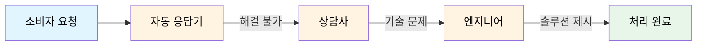

# Chain of Responsibility Pattern (책임 연쇄 패턴)

Chain of Responsibility Pattern(책임 연쇄 패턴, COR)은 요청을 처리할 수 있는 객체들을 **사슬(chain)처럼 연결**하고, 각 객체가 요청을 처리하지 못하면 **다음 객체로 책임을 전가**하는 행동 디자인 패턴이다.

요청을 보내는 쪽(sender)과 처리하는 쪽(receiver)을 **느슨하게 결합**시켜, 클라이언트가 어떤 객체가 요청을 처리할지 직접 알 필요가 없게 만든다. 특히 **중첩된 if-else 조건문을 최적화**하는 데 실무에서 자주 쓰인다.

예를 들어:
```python
class Handler:
    def __init__(self):
        self.next_handler = None
    def set_next(self, handler):
        self.next_handler = handler
        return handler  # 메서드 체이닝을 위해 인자를 그대로 반환
    def handle(self, request):
        # 처리 못하면 다음 핸들러로 책임 전가
        if self.next_handler:
            return self.next_handler.handle(request)
        return None

class ConcreteHandlerA(Handler):
    def handle(self, request):
        if request == "A":
            return "A를 ConcreteHandlerA가 처리"
        return super().handle(request)  # 다음 핸들러로 전가

class ConcreteHandlerB(Handler):
    def handle(self, request):
        if request == "B":
            return "B를 ConcreteHandlerB가 처리"
        return super().handle(request)

# 클라이언트는 어느 핸들러가 처리하는지 알 필요가 없음
a = ConcreteHandlerA()
b = ConcreteHandlerB()
a.set_next(b)  # a → b 체인 구성

print(a.handle("A"))  # A를 ConcreteHandlerA가 처리
print(a.handle("B"))  # B를 ConcreteHandlerB가 처리
print(a.handle("C"))  # None (체인 끝까지 처리 안 됨)
```
→ 각 핸들러는 **자신이 처리할 수 있는지만 판단**하고, 못하면 `super().handle()`을 통해 다음 핸들러로 떠넘긴다. 클라이언트는 체인의 시작점에만 요청을 보낸다.

## 실생활 비유: 고객센터 전화

책임 연쇄 패턴을 가장 직관적으로 보여주는 예시는 **고객센터 전화**다.



1. **자동 응답기(ARS)** 가 먼저 응답하고, 선택지에 없는 문의는 상담원 연결로 넘긴다.
2. **상담사**가 받았지만 기술적 문제라면 엔지니어에게 연결한다.
3. **엔지니어**가 적합한 솔루션을 제시하고 통화를 종료한다.

각 핸들러(자동 응답기 → 상담사 → 엔지니어)는 자신이 처리할 수 있는지 판단하고, 불가능하면 다음 핸들러로 떠넘긴다. 이 흐름을 코드로 구현한 것이 책임 연쇄 패턴이다.

## 문제가 있는 예시: 책임을 분리하여 연결짓기

책임 연쇄 패턴이 필요한 상황을 코드로 보자. 사용자로부터 URL 문자열을 입력받아 **프로토콜 / 도메인 / 포트**를 파싱해 출력하는 프로그램이다.

일반적으로는 아래처럼 처리문을 하나의 메서드로 통짜로 구성하게 된다.

**잘못된 예:**
```python
class UrlParser:
    @staticmethod
    def run(url):
        # protocol 파싱
        index = url.find("://")
        if index != -1:
            print("PROTOCOL :", url[:index])
        else:
            print("NO PROTOCOL")

        # domain 파싱
        start = url.find("://")
        last = url.rfind(":")
        if start == -1:
            print("DOMAIN :", url if last == -1 else url[:last])
        elif start != last:
            print("DOMAIN :", url[start + 3:last])
        else:
            print("DOMAIN :", url[start + 3:])

        # port 파싱
        idx = url.rfind(":")
        if idx != -1:
            try:
                print("PORT :", int(url[idx + 1:]))
            except ValueError:
                pass
```
위 코드의 문제점:

1. 하나의 메서드가 **프로토콜·도메인·포트 파싱을 모두 중앙 집권적으로** 담당한다.
2. path나 queryString 파싱 로직이 추가되면 이 메서드 전체를 수정하고 기존 로직과 겹치는지 복기해야 한다.
3. 이미 `find()` 호출이 곳곳에서 중복되고 있다.
4. "포트는 빼고 싶다" 같은 요구가 생기면 비슷한 코드의 메서드를 따로 만들어야 한다.

이는 요청 처리를 한 곳에 모두 쥐고 있기 때문에 생기는 현상이다. 이제 각 파싱 책임을 별개의 핸들러로 분리하고 체인으로 연결해보자.

**책임 연쇄 패턴 적용:**
```python
class Handler:
    def __init__(self):
        self.next_handler = None
    def set_next(self, handler):
        self.next_handler = handler
        return handler
    def process(self, url):  # 자식이 구체화하는 메서드
        raise NotImplementedError
    def run(self, url):
        self.process(url)
        if self.next_handler:  # 연결된 다음 핸들러로 책임 전가
            self.next_handler.run(url)

class ProtocolHandler(Handler):  # 프로토콜 파싱에만 집중
    def process(self, url):
        index = url.find("://")
        print("PROTOCOL :", url[:index] if index != -1 else "NONE")

class DomainHandler(Handler):    # 도메인 파싱에만 집중
    def process(self, url):
        start, last = url.find("://"), url.rfind(":")
        if start != -1 and start != last:
            print("DOMAIN :", url[start + 3:last])
        else:
            print("DOMAIN :", url[start + 3:] if start != -1 else url)

class PortHandler(Handler):      # 포트 파싱에만 집중
    def process(self, url):
        idx = url.rfind(":")
        if idx != -1 and url[idx + 1:].isdigit():
            print("PORT :", int(url[idx + 1:]))
```
이렇게 하면 프로토콜·도메인·포트 파싱이 각각 별개의 핸들러로 분리된다. 새로운 파싱 로직(path 등)이 필요하면 핸들러를 추가해 체인에 끼워넣기만 하면 된다.

클라이언트는 핸들러들을 연결한 뒤 체인의 시작점에만 요청을 보낸다.
```python
h1, h2, h3 = ProtocolHandler(), DomainHandler(), PortHandler()
h1.set_next(h2).set_next(h3)  # h1 → h2 → h3

h1.run("http://www.youtube.com:80")
# PROTOCOL : http
# DOMAIN : www.youtube.com
# PORT : 80
```

핸들러는 본인의 역할만 수행하고, 새로운 처리가 필요하면 핸들러를 추가해 체인에 끼워넣으면 된다. 기존 `ProtocolHandler`·`DomainHandler` 등의 코드나 클라이언트 코드는 손댈 필요가 거의 없다.

책임 연쇄 패턴의 가장 큰 특징은 **요청 처리 로직 자체를 객체화**한다는 점이다. 전략 패턴이 알고리즘을, 상태 패턴이 상태를 객체화하듯, 책임 연쇄 패턴은 **조건 분기문(if-else) 하나하나를 핸들러 클래스로 표현**한 것으로 볼 수 있다.
- 런타임에 동적으로 체인 구성/변경 가능
- 핸들러끼리의 연결 구조는 리스트형·선형·트리 등 무엇이든 가능
- 요청의 호출자(invoker)와 수신자(receiver)를 분리

## 중첩된 if-else 문 재구성하기

책임 연쇄 패턴이 빛을 발하는 또 다른 사례는 **중첩된 if-else 조건문**을 풀어내는 것이다. 사용자가 미들웨어를 통해 로그인하는 과정을 예로 보자.

**잘못된 예:**
```python
class Server:
    def __init__(self):
        self.users = {}
    def register(self, email, password):
        self.users[email] = password
    def has_email(self, email):
        return email in self.users
    def is_valid_password(self, email, password):
        return self.users.get(email) == password

class Middleware:
    def __init__(self, server):
        self.server = server
        self.limit, self.count = 3, 0
    def limit_login_attempt(self):
        if self.count > self.limit:
            print("로그인 요청 횟수 제한 !!"); return False
        self.count += 1; return True
    def authorize(self, email, password):
        if not self.server.has_email(email):
            print("가입된 이메일이 없습니다 !"); return False
        if not self.server.is_valid_password(email, password):
            print("패스워드가 다릅니다 !"); return False
        return True
    def authenticate(self, email):
        return email == "admin@site.com"

# 클라이언트 실행부: 중첩 if-else 지옥
def login(mw, email, password):
    if mw.limit_login_attempt():
        if mw.authorize(email, password):
            if mw.authenticate(email):
                print("Hello, admin!")
            else:
                print("요청을 로깅합니다.")
        else:
            return "retry"
    else:
        raise RuntimeError("로그인 시도 횟수 초과")
```
동작은 하지만 클라이언트 실행부가 **중첩 if-else로 뒤엉켜** 있다. 단계가 늘어날수록 분기가 안정적으로 동작하는지 확신하기 어렵고, 새 인증 단계가 추가되면 분기문 전체를 뜯어고쳐야 한다. 각 인증 로직을 핸들러로 분리하고 체인으로 연결해보자.

**책임 연쇄 패턴 적용:**
```python
# flag: 클라이언트 루프 제어용 정수
#  -2: 예외 / -1: break(종료) / 0: continue(재입력) / 1: 통과
class Middleware:
    def __init__(self):
        self.next_middleware = None
    def set_next(self, mw):
        self.next_middleware = mw
        return mw
    def check(self, email, password):
        if self.next_middleware:  # 처리 못하면 다음 핸들러로
            return self.next_middleware.check(email, password)
        return 1

class LimitLoginAttempt(Middleware):  # 로그인 시도 횟수 제한에만 집중
    def __init__(self):
        super().__init__(); self.limit, self.count = 3, 0
    def check(self, email, password):
        if self.count > self.limit:
            print("로그인 요청 횟수 제한 !!"); return -2
        self.count += 1
        return super().check(email, password)

class Authorize(Middleware):          # 이메일/패스워드 인증에만 집중
    def __init__(self, server):
        super().__init__(); self.server = server
    def check(self, email, password):
        if not self.server.has_email(email):
            print("가입되지 않은 이메일 !"); return 0
        if not self.server.is_valid_password(email, password):
            print("패스워드가 다릅니다 !"); return 0
        return super().check(email, password)

class Authenticate(Middleware):       # 관리자/일반 유저 판별에만 집중
    def check(self, email, password):
        if email == "admin@site.com":
            print("Hello, admin!"); return -1
        print("Hello, user!")
        return super().check(email, password)

class Logging(Middleware):            # 로깅에만 집중
    def check(self, email, password):
        print("요청을 로깅합니다.")
        return -1
```
각 인증 단계가 별개의 핸들러로 분리되었다. 부모 `check()`를 자식이 오버라이드하되, 다음 단계로 넘겨야 할 때 `super().check()`를 호출하는 식으로 체인을 잇는다(상속을 활용한 체이닝).

클라이언트 실행부는 핸들러가 반환한 정수 flag만 보고 루프를 제어한다.
```python
server = Server()
server.register("admin@site.com", "789789")

# 체인 구성: 횟수제한 → 인증 → 권한판별 → 로깅
chain = LimitLoginAttempt()
chain.set_next(Authorize(server)).set_next(Authenticate()).set_next(Logging())

while True:
    email = input("Email: ")
    password = input("Password: ")
    result = chain.check(email, password)  # 단 한 줄!
    if result == -2:
        raise RuntimeError("로그인 시도 횟수 초과")
    elif result == -1:
        break
    elif result == 0:
        continue
```
오히려 코드 양은 늘었지만, **실행부가 한눈에 들어오게 단순해졌다**는 데 의의가 있다. 새 인증 단계가 필요하면 핸들러를 만들어 `set_next()`로 끼워넣기만 하면 된다.

## 언제 Chain of Responsibility 패턴을 사용해야 하는가?

책임 연쇄 패턴은 다음과 같은 상황에서 유용하다:

### 1. 여러 객체가 요청을 판별·처리해야 할 때

특정 요청을 2개 이상의 객체에서 판별하고 처리해야 하거나, **특정 순서로 여러 핸들러를 실행**해야 할 때 사용한다.

예시:
- URL/문자열 파싱 (프로토콜 → 도메인 → 포트)
- 로그인/인증 미들웨어 (횟수제한 → 인증 → 권한판별 → 로깅)
- 예외 처리 핸들러 체인

### 2. 요청 유형과 처리 순서를 미리 알 수 없을 때

다양한 종류의 요청을 처리할 것으로 예상되지만 정확한 유형과 순서를 미리 알 수 없거나, **처리 객체 집합이 런타임에 동적으로 결정**되어야 할 때 사용한다.

예시:
- 웹 서버 필터 체인 (인증/로깅/캐싱 등을 동적으로 조합)
- GUI 이벤트 버블링 (자식 → 부모 위젯으로 이벤트 전파)

## 구현 방법

1. 핸들러 인터페이스를 선언하고, 요청을 처리하는 메서드 하나를 정의한다.

2. 모든 구상 핸들러가 공유할 수 있도록, 다음 핸들러에 대한 참조를 저장할 필드와 `set_next()` 메서드를 가진 기초 핸들러 클래스를 만든다.

3. 기초 핸들러를 상속하여 구상 핸들러들을 하나씩 만든다. 각 핸들러는 두 가지를 결정한다.
- 자신이 요청을 처리할 수 있는가?
- 처리할 수 없다면 다음 핸들러로 넘길 것인가?

4. 클라이언트는 체인을 직접 조립하거나, 미리 만들어진 체인을 전달받는다. 체인은 런타임에 동적으로 구성될 수 있다.

5. 클라이언트는 체인의 **첫 번째 핸들러**에만 요청을 전달한다. 요청은 처리될 때까지(또는 체인 끝까지) 전파된다.

## 장단점

### 장점

✅ **요청의 호출자(invoker)와 수신자(receiver)를 분리할 수 있음**
- 클라이언트는 어떤 핸들러가 요청을 처리할지 몰라도 되며, 처리 방법이 바뀌어도 호출자 코드는 변경되지 않는다.

✅ **체인을 런타임에 동적으로 구성할 수 있음**
- 클라이언트 코드를 건드리지 않고 핸들러를 추가/삭제하거나 순서를 바꿔 처리 흐름을 재구성할 수 있다.

✅ **중첩 조건문을 평탄하게 만들 수 있음**
- 길게 늘어지는 if-else 분기를 독립적인 핸들러 객체들로 풀어내, 실행부를 한눈에 들어오게 단순화한다.

✅ **하나의 요청을 여러 단계로 나눠 처리·검증할 수 있음**
- 인증, 권한 검사, 로깅 같은 단계를 각 핸들러로 분리해 흐름을 명확하게 표현한다.

### 단점

❌ **요청이 반드시 처리된다는 보장이 없음**
- 체인 끝까지 갔는데도 어떤 핸들러도 처리하지 않을 수 있다.

❌ **디버깅과 흐름 추적이 어려움**
- 어떤 핸들러가 요청을 처리하는지 런타임에 추적하기 까다롭다.

❌ **무한 사이클 위험**
- 체인 구성이 잘못되면 핸들러 간 순환 참조로 무한 루프가 발생할 수 있다.

❌ **처리 지연 가능성**
- 체인이 길어질수록 처리 과정이 느려질 수 있다. 요청-처리 관계가 고정적이고 속도가 중요하다면 사용을 재고해야 한다.

❌ **핸들러 순서에 동작이 의존함**
- 같은 핸들러들이라도 연결 순서에 따라 결과가 달라지므로, 체인의 순서 관리가 중요하다.

❌ **단순한 로직에는 과한 구조**
- 처리 후보가 하나뿐이거나 흐름이 고정적이라면 핸들러 분리가 오히려 불필요한 복잡성을 더한다.

## 실무에서 찾아보는 Chain of Responsibility 패턴

- **Java**: `java.util.logging.Logger`의 `log()`, `javax.servlet.Filter`의 `doFilter()` (서블릿 필터 체인)
- **Spring**: Spring Security의 `SecurityFilterChain` (인증/인가 필터들을 체인으로 구성)
- **Python**: Django/Flask의 미들웨어 스택, `logging` 모듈의 핸들러 전파
- **프론트엔드**: DOM 이벤트 버블링/캡처링 (이벤트가 핸들러 체인을 따라 전파)

## 용어 정리

**Handler (핸들러)**: 요청 처리 메서드와 다음 핸들러 참조(`set_next`)를 정의하는 인터페이스/추상 클래스  
**ConcreteHandler (구체적 핸들러)**: 요청을 실제로 처리하거나 다음 핸들러로 전가하는 구현 객체  
**Client (클라이언트)**: 체인을 구성하고 첫 번째 핸들러에 요청을 전달하는 객체  

1. URL 파서 예시:  
- Handler (핸들러) → Handler
- ConcreteHandler (구체적 핸들러) → ProtocolHandler, DomainHandler, PortHandler

2. 로그인 미들웨어 예시:
- Handler (핸들러) → Middleware
- ConcreteHandler (구체적 핸들러) → LimitLoginAttempt, Authorize, Authenticate, Logging

## 한 줄 요약

책임 연쇄 패턴은 **처리 후보가 여러 개이고, 순서대로 넘기며 처리 여부를 결정해야 할 때** 유용하다.

즉:

> 처리 흐름이 동적이고 단계가 여럿이라면 책임 연쇄 패턴이 빛을 발한다. 반대로 처리 흐름이 고정적이고 단순하다면, 평범한 조건문이나 명시적인 호출 구조가 오히려 더 낫다.
