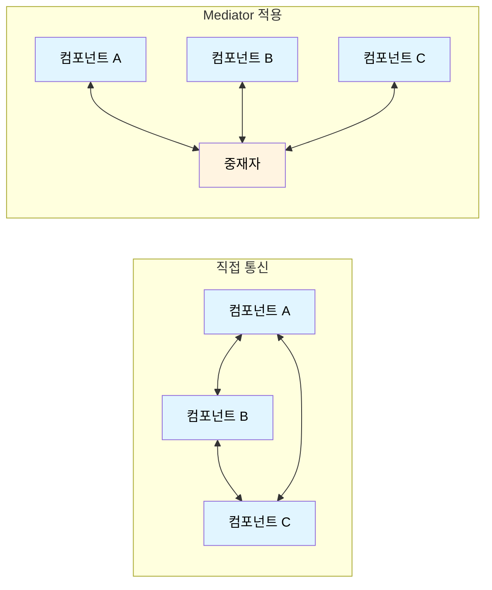
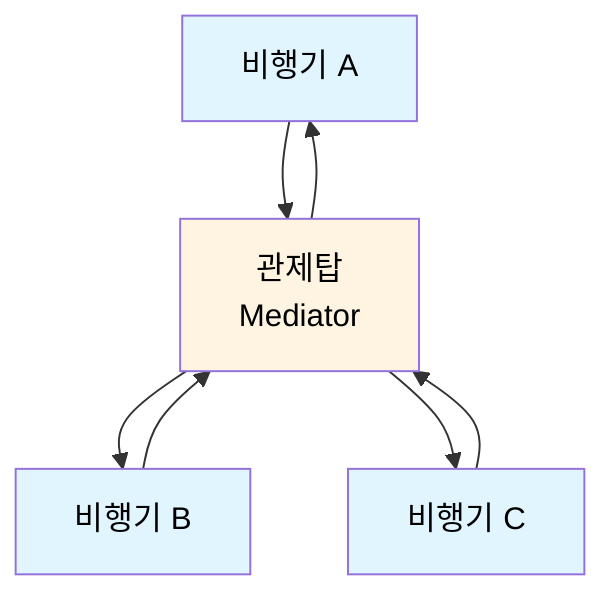
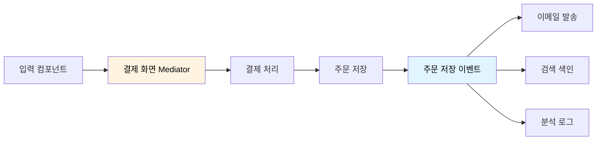

# Mediator Pattern (중재자 패턴)

Mediator Pattern(중재자 패턴)은 여러 객체가 서로 직접 통신하던 방식을, **중재자(Mediator) 객체 하나를 통한 통신**으로 바꾸는 행동 디자인 패턴이다.

객체들은 서로의 구체적인 구현을 알 필요 없이 중재자에게만 요청을 보낸다. 중재자는 요청을 받은 뒤 적절한 객체에게 전달하거나, 여러 객체의 동작 순서를 조율한다. 즉, 복잡하게 얽힌 객체들의 관계를 **허브 하나로 모아 결합도를 낮추는 패턴**이다.

중요한 점은 Mediator가 단순히 호출을 대신 전달하는 객체가 아니라는 것이다. **"A의 이 이벤트가 일어나면 B와 C는 무엇을 해야 하는가?"라는 협력 규칙 자체를 소유**한다. 각 객체가 자기 일을 수행하고, 객체 사이의 업무 흐름은 중재자가 결정한다.



예를 들어 채팅방에서 사용자들이 서로에게 직접 메시지를 보내는 대신, 채팅방이 메시지를 받아 다른 사용자에게 전달하도록 만들 수 있다.

```python
class Mediator:
    def notify(self, sender, event):
        raise NotImplementedError

class ChatRoom(Mediator):
    def __init__(self):
        self.users = []

    def join(self, user):
        self.users.append(user)
        user.mediator = self

    def notify(self, sender, message):
        # 발신자를 제외한 사용자에게 메시지를 전달
        for user in self.users:
            if user is not sender:
                user.receive(sender.name, message)

class User:
    def __init__(self, name):
        self.name = name
        self.mediator = None

    def send(self, message):
        self.mediator.notify(self, message)  # 다른 User를 직접 호출하지 않음

    def receive(self, sender_name, message):
        print(f"{self.name} <- {sender_name}: {message}")

room = ChatRoom()
alice, bob, chloe = User("Alice"), User("Bob"), User("Chloe")

for user in (alice, bob, chloe):
    room.join(user)

alice.send("안녕하세요!")
# Bob <- Alice: 안녕하세요!
# Chloe <- Alice: 안녕하세요!
```

→ `Alice`는 `Bob`, `Chloe`라는 객체가 존재하는지조차 알 필요가 없다. 오직 `ChatRoom`에 메시지를 보낼 뿐이며, 누구에게 어떻게 전달할지는 중재자가 결정한다.

## 실생활 비유: 관제탑

중재자 패턴을 이해하기 좋은 비유는 **공항 관제탑**이다. 비행기들이 서로에게 직접 “내가 착륙할게요”, “활주로를 비워 주세요”라고 연락한다면 통신 관계가 매우 복잡해진다. 대신 모든 비행기는 관제탑에만 연락하고, 관제탑이 이착륙 순서와 활주로 사용을 조정한다.



이때 비행기는 다른 비행기의 위치나 상태를 직접 조회하지 않는다. 관제탑이 필요한 정보를 모아 “A는 대기”, “B는 착륙”처럼 지시한다. 이 관제탑이 Mediator이고, 비행기들이 **Colleague(동료 객체)** 이다.

## 문제가 있는 예시: 서로를 직접 아는 UI 컴포넌트

회원가입 화면에서 체크박스에 동의하면 제출 버튼이 활성화되고, 국가를 선택하면 전화번호 입력 힌트가 바뀌며, 제출 버튼을 누르면 유효성 검사가 실행된다고 해보자.

처음에는 각 UI 컴포넌트가 다른 컴포넌트를 직접 참조하는 방식으로 쉽게 구현할 수 있다.

**잘못된 예:**
```python
class CheckBox:
    def __init__(self, submit_button):
        self.checked = False
        self.submit_button = submit_button

    def check(self):
        self.checked = True
        self.submit_button.enable()  # SubmitButton을 직접 앎

class CountrySelector:
    def __init__(self, phone_field):
        self.phone_field = phone_field

    def select(self, country):
        if country == "KR":
            self.phone_field.set_hint("010-1234-5678")
        elif country == "US":
            self.phone_field.set_hint("(555) 123-4567")

class SubmitButton:
    def __init__(self, checkbox, phone_field):
        self.checkbox = checkbox
        self.phone_field = phone_field
        self.enabled = False

    def enable(self):
        self.enabled = True

    def click(self):
        if self.checkbox.checked and self.phone_field.is_valid():
            print("회원가입 요청 전송")
```

이 코드의 문제점은 다음과 같다.

1. 각 컴포넌트가 다른 컴포넌트의 구체적인 클래스와 상태를 알아야 한다.
2. 이메일 인증 필드, 마케팅 동의, 국가별 추가 검증 등이 생기면 참조 관계가 급격히 늘어난다.
3. 컴포넌트 하나의 변경이 여러 컴포넌트의 수정으로 이어진다.
4. 화면의 상호작용 규칙이 여러 클래스에 흩어져 있어 전체 흐름을 파악하기 어렵다.

이처럼 객체들이 서로를 직접 호출하면 시간이 갈수록 객체 간 관계가 **그물망처럼 얽힌다.** 이 상호작용 규칙을 중재자에게 모아 보자.

## Mediator Pattern 적용: UI 대화상자가 흐름을 조율하기

```python
class RegistrationDialog:
    """UI 컴포넌트 사이의 상호작용 규칙만 담당하는 Mediator"""
    def __init__(self):
        self.terms = CheckBox(self)
        self.country = CountrySelector(self)
        self.phone = PhoneField(self)
        self.submit = SubmitButton(self)

    def notify(self, sender, event, value=None):
        if sender is self.terms and event == "checked":
            self.submit.set_enabled(self.phone.is_valid())

        elif sender is self.country and event == "changed":
            hints = {"KR": "010-1234-5678", "US": "(555) 123-4567"}
            self.phone.set_hint(hints.get(value, "전화번호를 입력하세요"))
            self.submit.set_enabled(self.terms.checked and self.phone.is_valid())

        elif sender is self.phone and event == "changed":
            self.submit.set_enabled(self.terms.checked and self.phone.is_valid())

        elif sender is self.submit and event == "clicked":
            if self.terms.checked and self.phone.is_valid():
                print("회원가입 요청 전송")
            else:
                print("약관과 전화번호를 확인하세요.")

class CheckBox:
    def __init__(self, mediator):
        self.mediator, self.checked = mediator, False

    def check(self):
        self.checked = True
        self.mediator.notify(self, "checked")

class CountrySelector:
    def __init__(self, mediator):
        self.mediator = mediator

    def select(self, country):
        self.mediator.notify(self, "changed", country)

class PhoneField:
    def __init__(self, mediator):
        self.mediator, self.value, self.hint = mediator, "", ""

    def set_hint(self, hint):
        self.hint = hint
        print(f"전화번호 힌트: {hint}")

    def input(self, value):
        self.value = value
        self.mediator.notify(self, "changed")

    def is_valid(self):
        return len(self.value.replace("-", "")) >= 10

class SubmitButton:
    def __init__(self, mediator):
        self.mediator, self.enabled = mediator, False

    def set_enabled(self, enabled):
        self.enabled = enabled
        print(f"제출 버튼: {'활성화' if enabled else '비활성화'}")

    def click(self):
        self.mediator.notify(self, "clicked")
```

클라이언트는 대화상자의 컴포넌트를 조작할 수 있지만, 컴포넌트들은 서로를 직접 호출하지 않는다.

```python
dialog = RegistrationDialog()

dialog.country.select("KR")
# 전화번호 힌트: 010-1234-5678
# 제출 버튼: 비활성화

dialog.terms.check()
# 제출 버튼: 비활성화

dialog.phone.input("010-1234-5678")
# 제출 버튼: 활성화

dialog.submit.click()
# 회원가입 요청 전송
```

이제 `CheckBox`는 제출 버튼이 존재하는지 모르고, `PhoneField`도 약관 체크 상태를 모른다. 각 객체는 자신의 상태를 바꾸고 중재자에게 이벤트만 알린다. **컴포넌트 간의 조합 규칙은 `RegistrationDialog` 한 곳에서 확인할 수 있다.**

## 무엇이 분리되는가: 객체의 기능과 협력 규칙

Mediator는 객체의 책임을 없애거나 모든 로직을 중재자로 옮기는 패턴이 아니다. **각 객체의 고유 기능은 동료 객체에 남기고, 여러 객체를 함께 움직이게 하는 규칙만 중재자로 옮긴다.**

| 객체 | 객체가 계속 담당할 일 | 중재자가 담당할 일 |
| --- | --- | --- |
| `CheckBox` | 체크 상태 저장, 클릭 처리 | 체크 후 제출 버튼을 다시 계산할지 결정 |
| `PhoneField` | 전화번호 저장, 형식 검증 | 국가 변경 시 어떤 힌트를 적용할지 결정 |
| `SubmitButton` | 활성화 상태 표시, 클릭 이벤트 발생 | 클릭 시 검증·제출·오류 안내의 순서 결정 |

그래서 `PhoneField`는 주문서나 프로필 수정 화면에서도 재사용할 수 있다. 새 `EmailField`가 추가되어도 기존 컴포넌트에 서로를 참조하는 코드를 더하지 않고, `RegistrationDialog`에 새로운 협력 규칙을 추가하면 된다.

반대로 중재자가 모든 도메인 로직과 화면 로직을 받아들여 거대해지면 **God Object**가 된다. 중재자는 화면·기능·업무 흐름 단위로 작게 나누는 편이 좋다. 예를 들어 회원가입과 결제의 규칙을 하나의 `AppMediator`에 모으기보다 각각의 중재자로 분리한다.

## Facade Pattern과 차이

Mediator와 Facade는 모두 결합도를 낮추지만, 해결하려는 문제가 다르다.

**Mediator**는 여러 동료 객체의 **협력과 흐름을 조율**한다. 동료 객체는 중재자를 알지만 서로의 존재와 API는 알 필요가 없다. 대화상자, 채팅방, 항공 관제가 대표적인 예다.

**Facade**는 복잡한 서브시스템을 쉽게 쓰도록 **단순한 진입점**을 제공한다. 클라이언트는 Facade를 사용하지만, 서브시스템은 Facade의 존재를 모른다. 주문 API나 홈시어터 제어가 이에 해당한다.

Facade는 외부 클라이언트가 내부 시스템을 쉽게 사용하도록 만드는 **입구**이고, Mediator는 내부 객체들이 서로 얽히지 않도록 만드는 **교통정리 담당자**다. Facade 뒤의 서브시스템 객체들은 여전히 서로 직접 통신할 수 있지만, Mediator의 동료 객체들은 협력할 때 중재자를 거치도록 설계한다.

## Observer Pattern과 차이

Mediator와 Observer는 모두 객체가 서로의 구체 구현을 덜 알게 만든다. 하지만 Observer가 해결하는 문제는 **"상태가 바뀌었으니 관심 있는 모두에게 알려야 한다"** 이고, Mediator가 해결하는 문제는 **"이 이벤트가 일어난 지금 누구를 어떤 순서로 움직여야 하는가"** 이다.

Observer에서는 Subject가 상태 변화를 발행하고, 등록된 Observer들이 같은 이벤트를 독립적으로 받는다.

```python
# Subject는 수신자들의 구체적인 일을 모른다.
stock.set_price(100_000)
# 투자자 알림, 뉴스 게시, 분석 데이터 갱신 등이 각각 반응
```

Subject는 보통 “구독자 전원에게 알린다”까지만 책임진다. 한 Observer가 다른 Observer보다 먼저 성공해야 하는지, 실패를 어떤 객체가 복구하는지는 Observer 패턴의 중심 관심사가 아니다. 따라서 구독자는 런타임에 자유롭게 추가·제거하기 좋고, 상태 변화 뒤의 부수 효과를 느슨하게 붙이기 좋다.

Mediator에서는 동료 객체가 중재자에게 이벤트를 알리고, 중재자가 현재 상태를 보고 **필요한 대상만 선택해 다음 동작을 지시**한다.

```python
# 체크박스는 자기 상태만 바꾸고, 다음 일을 결정하지 않는다.
terms.check()
# RegistrationDialog가 전화번호 유효성까지 확인한 뒤
# SubmitButton을 활성화할지 결정한다.
```

여기서 `CheckBox` 이벤트는 `PhoneField`, `SubmitButton` 모두에게 방송되지 않는다. 중재자는 “약관 동의만으로는 부족하고 전화번호도 유효해야 한다”는 규칙을 알고 있으므로, `SubmitButton`에 필요한 상태만 반영한다. 이벤트의 **수신자·순서·조건·결과 전달**이 중재자의 책임이다.

### 한 단계가 다음 단계의 입력인가?

둘을 구분하는 실용적인 기준은 이것이다.

- 이벤트를 받은 객체들이 서로 독립적으로 반응해도 된다면 → **Observer**
- 앞 단계의 결과가 다음 대상과 다음 행동을 결정한다면 → **Mediator**

예를 들어 주문이 저장된 뒤 이메일 발송, 검색 색인 갱신, 분석 로그 기록을 붙이는 일은 Observer에 잘 맞는다. 각 작업은 “주문 저장됨”이라는 사실만 알면 되고, 서로를 알 필요가 없다.

반대로 결제 화면에서 “쿠폰 적용 → 할인 금액 재계산 → 결제 버튼 활성화 → 결제 수단별 추가 인증”은 Mediator에 가깝다. 할인 계산 결과가 다음 단계의 조건이 되고, 결제 수단에 따라 실행할 대상도 달라지기 때문이다.

### 함께 사용하는 경우

두 패턴은 경쟁 관계가 아니다. 하나의 기능 안에서도 역할을 나눠 함께 쓸 수 있다.



결제 전 화면의 조건부 흐름은 Mediator가 조율하고, 주문 저장 후 서로 독립적인 부수 효과는 Observer 방식으로 알린다. 채팅방 예제처럼 Mediator가 여러 사용자에게 메시지를 보낸다고 해서 자동으로 Observer가 되는 것은 아니다. 참여자·수신 범위·권한·메시지 형식을 **중앙에서 조율**한다면 그 핵심은 Mediator다.

## 장점과 주의할 점

### 장점

1. **다대다 관계를 단순화한다**
   - 동료 객체는 서로의 API를 알 필요 없이 중재자 하나에만 의존한다.

2. **협력 흐름을 한 곳에서 읽을 수 있다**
   - "국가 선택 → 힌트 변경 → 버튼 상태 갱신" 같은 규칙이 여러 컴포넌트에 흩어지지 않는다.

3. **컴포넌트를 재사용하기 쉬워진다**
   - 화면마다 다른 상호작용 규칙은 별도의 Mediator로 교체할 수 있다.

### 주의할 점

1. **중재자가 God Object가 될 수 있다**
   - 이벤트 분기가 끝없이 늘어난다면 중재자를 화면·유스케이스 단위로 쪼갠다.

2. **단순한 관계에는 오히려 복잡하다**
   - 두 객체가 한 번만 협력하는 정도라면 직접 호출이 더 명확할 수 있다.

3. **흐름이 중재자에 숨는다**
   - 동료 객체의 코드를 읽는 것만으로 다음 동작을 알 수 없다. 이벤트 이름을 구체적으로 짓고, 중재자의 규칙을 작고 응집력 있게 유지해야 한다.

## Mediator Pattern은 다음과 같은 상황에서 유용하다

1. **여러 객체가 복잡하게 서로 호출할 때**

- UI 폼의 입력 필드, 버튼, 체크박스 간 상호작용
- 채팅방의 사용자, 귓속말, 차단, 입·퇴장 처리
- 항공 관제, 게임 로비, 스마트 홈 기기 제어

2. **객체 재사용성을 높이고 싶을 때**

- `PhoneField`를 회원가입 화면뿐 아니라 주문서 화면에도 사용하고 싶을 때
- 화면별 상호작용 규칙만 각각의 Mediator로 분리하고 싶을 때

3. **업무 흐름의 순서와 조건을 한 곳에서 관리해야 할 때**

- 주문 → 결제 → 재고 차감 → 알림 발송 과정
- 여러 서비스나 모듈의 호출 순서를 조정하는 오케스트레이터

## 용어 정리

**Mediator (중재자)**: 동료 객체 간 통신과 협력 규칙을 정의하는 인터페이스 또는 객체  
**ConcreteMediator (구체적 중재자)**: 실제 객체들을 보관하고 이벤트에 따라 필요한 동작을 조율하는 객체  
**Colleague (동료 객체)**: 중재자와 통신하지만 다른 동료 객체를 직접 참조하지 않는 객체  
**notify()**: 동료 객체가 상태 변화나 이벤트를 중재자에게 알리는 메서드

회원가입 화면 예시로 정리하면 다음과 같다.

- Mediator → `RegistrationDialog`
- ConcreteMediator → `RegistrationDialog`
- Colleague → `CheckBox`, `CountrySelector`, `PhoneField`, `SubmitButton`

Mediator Pattern의 핵심은 “객체 사이의 연결을 없애는 것”이 아니라, **복잡한 연결을 이해하기 쉬운 한 곳으로 옮기는 것**이다. 객체끼리 강하게 얽히기 시작했다면, 그 협력 규칙을 중재자로 추출할 수 있는지 살펴보자.
