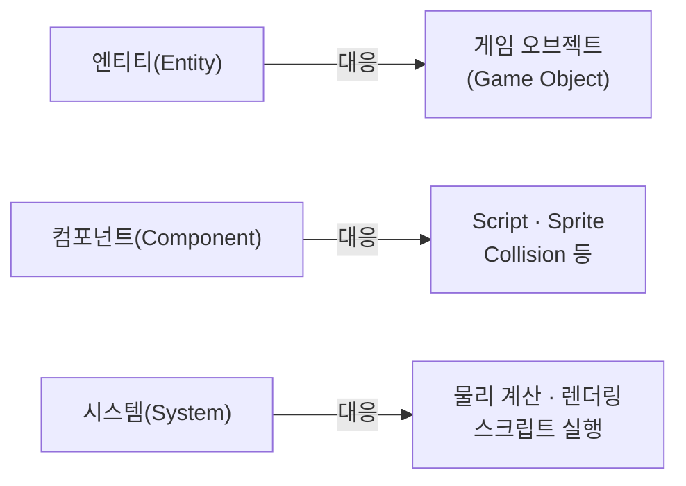
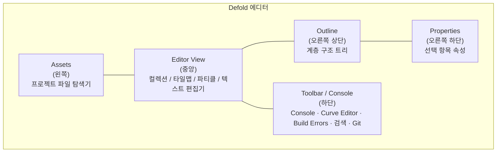
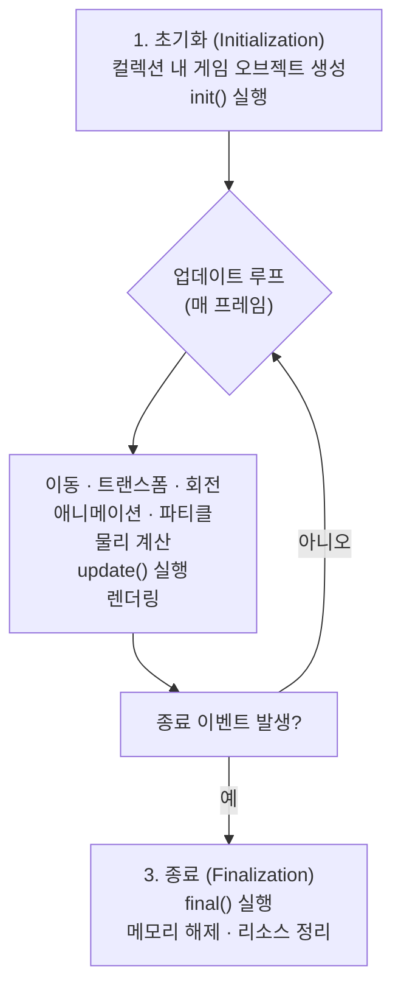

> **시리즈**: Defold 입문 — 1편: 기본 개념과 에디터 이해

## 개요

Defold는 무료 크로스플랫폼 2D 게임 엔진이다. 이 글에서는 Defold를 처음 접하는 개발자를 위해 엔진의 핵심 구성 요소, 에디터 레이아웃, 그리고 애플리케이션 라이프사이클을 정리한다.

---

## 1. Defold의 기본 블록: 게임 오브젝트

Defold에서 모든 것의 출발점은 **게임 오브젝트(Game Object)** 다.

게임 오브젝트는 세 가지를 기본으로 가진다.

- **ID** — 오브젝트를 식별하는 고유 값
- **URL 주소** — 메시징 시스템에서 오브젝트를 가리키는 주소
- **트랜스폼(Transform)** — 위치(Position), 회전(Rotation), 크기(Scale)

이것만으로는 아무것도 보이지 않는다. 게임 오브젝트 자체는 껍데기이고, 실제 기능은 **컴포넌트(Component)** 를 붙여서 만든다.

---

## 2. 컴포넌트: 게임 오브젝트에 기능 붙이기

컴포넌트는 게임 오브젝트에 부착하여 특정 기능을 부여하는 단위다. 대표적인 컴포넌트는 다음과 같다.

| 컴포넌트 | 역할 |
|---|---|
| Sprite | 오브젝트의 시각적 표현 (2D 이미지) |
| Collision Object | 물리 충돌 처리 |
| Sound | 사운드 재생 |
| **Script** | **게임 로직 보유** |
| Factory | 코드에서 게임 오브젝트 동적 생성 |
| Collection Factory | 코드에서 컬렉션 동적 생성 |

이 중 **Script 컴포넌트**가 핵심이다. 게임 로직은 전부 여기에 담긴다. 나머지 컴포넌트들은 각자 고유한 속성을 가지며, 추후 글에서 하나씩 다룬다.

---

## 3. ECS와의 유사성

Defold의 워크플로는 **엔티티-컴포넌트 시스템(ECS, Entity-Component System)** 과 유사한 구조다.



엔진 내부의 물리 계산, 렌더링, 스크립트 로직 실행은 각각의 시스템이 데이터 셋을 처리하는 방식으로 동작한다. 또한 Defold는 **메시징 시스템**을 통해 반응형 설계를 권장하는데, 이 부분은 이후 글에서 별도로 다룬다.

---

## 4. 컬렉션: 오브젝트를 묶는 단위

게임 오브젝트가 여러 개라면 **컬렉션(Collection)** 으로 묶는다.

컬렉션은 두 가지 역할을 한다.

1. **런타임에 어떤 게임 오브젝트가 생성될지 정의**
2. **오브젝트 간 계층 구조(부모-자식 관계) 유지**

계층 구조는 에디터 Outline 패널의 트리 뷰로 확인할 수 있고, 부모 오브젝트의 트랜스폼이 자식에게 전파된다. 정리가 필요하면 컬렉션 안에 컬렉션을 중첩해서 넣을 수도 있다.

### 다른 엔진 사용자를 위한 비교

| 엔진 | 유사 개념 |
|---|---|
| Unity | Game Object + Component / Scene |
| Unreal | Actor + Component / Level |
| Godot | Node (고유 속성을 가진 오브젝트) / Scene |
| **Defold** | **Game Object + Component / Collection** |

---

## 5. 에디터 레이아웃

Defold 에디터는 여섯 개 영역으로 구성된다.



각 영역의 역할은 다음과 같다.

- **Assets** (왼쪽): 프로젝트의 모든 파일을 탐색기 트리 형태로 표시
- **Editor View** (중앙): 현재 열린 파일에 따라 컬렉션/텍스트/파티클/타일맵 편집기 전환. 화면을 반으로 나눠 두 개 동시 편집 가능
- **Outline** (오른쪽 상단): 현재 선택된 컬렉션, 게임 오브젝트, 컴포넌트의 계층 구조 표시
- **Properties** (오른쪽 하단): 현재 선택된 항목의 속성 표시 및 편집
- **Toolbar / Console** (하단): 콘솔 출력, 곡선 편집기, 빌드 에러, 검색 결과, Git 변경 파일 목록

각 패널의 크기는 자유롭게 조절할 수 있고, 필요 없는 패널은 숨길 수 있다. 메뉴 또는 단축키 `F6` ~ `F8`로 패널 표시 여부를 전환한다.

> Defold 공식 문서의 [에디터 개요](https://defold.com/manuals/editor/)에서 모든 기능을 확인할 수 있다. Defold 문서는 전반적으로 품질이 높다.

---

## 6. 프로젝트 파일 (`game.project`)

Defold 프로젝트를 열면 루트에 `game.project` 파일이 하나 있다. 이 파일이 **프로젝트 전체의 유일한 설정 파일**이다.

주요 설정 항목:

- **Bootstrap** — 런타임에 엔진이 처음 로드하는 컬렉션 지정
- 해상도, 타이틀, 아이콘 등 빌드/앱 관련 설정

`game.project`는 에디터에서 직접 열거나, Assets 패널에서 파일을 더블클릭해서 열 수 있다.

---

## 7. 애플리케이션 라이프사이클

Defold는 세 단계의 사이클로 동작한다.



### Script 컴포넌트의 생명주기 함수

```lua
function init(self)
    -- 초기화 단계에서 한 번 실행
    -- 초기값 설정, 리소스 로드 등
end

function update(self, dt)
    -- 매 프레임 실행 (dt = delta time, 이전 프레임과의 시간 간격)
    -- 이동, 입력 처리, 게임 로직 등
end

function final(self)
    -- 오브젝트가 삭제되거나 앱이 종료될 때 실행
    -- 메모리 해제, 정리 작업 등
end
```

대부분의 게임 로직은 `update()` 안에서 처리한다. 라이프사이클의 전체 구조를 깊게 이해하지 않아도 `init`, `update`, `final` 세 함수의 역할만 파악하면 개발을 시작하기에 충분하다.

---

## 정리

| 개념 | 한 줄 요약 |
|---|---|
| Game Object | ID + 트랜스폼을 가진 기본 단위. 컴포넌트로 기능 추가 |
| Component | 오브젝트에 부착하는 기능 단위 (Script, Sprite, Collision 등) |
| Collection | 게임 오브젝트의 그룹. 계층 구조와 인스턴스화 단위 |
| Factory | 코드에서 오브젝트 또는 컬렉션을 동적으로 생성하는 컴포넌트 |
| game.project | 프로젝트 전체 설정 파일. Bootstrap 컬렉션 지정 포함 |
| init() | 초기화 단계에서 한 번 실행 |
| update() | 매 프레임 실행되는 게임 루프 |
| final() | 종료 시 실행 |

다음 글에서는 실제로 간단한 게임을 만들면서 컴포넌트 사용법과 스크립트 작성 방법을 다룬다.
