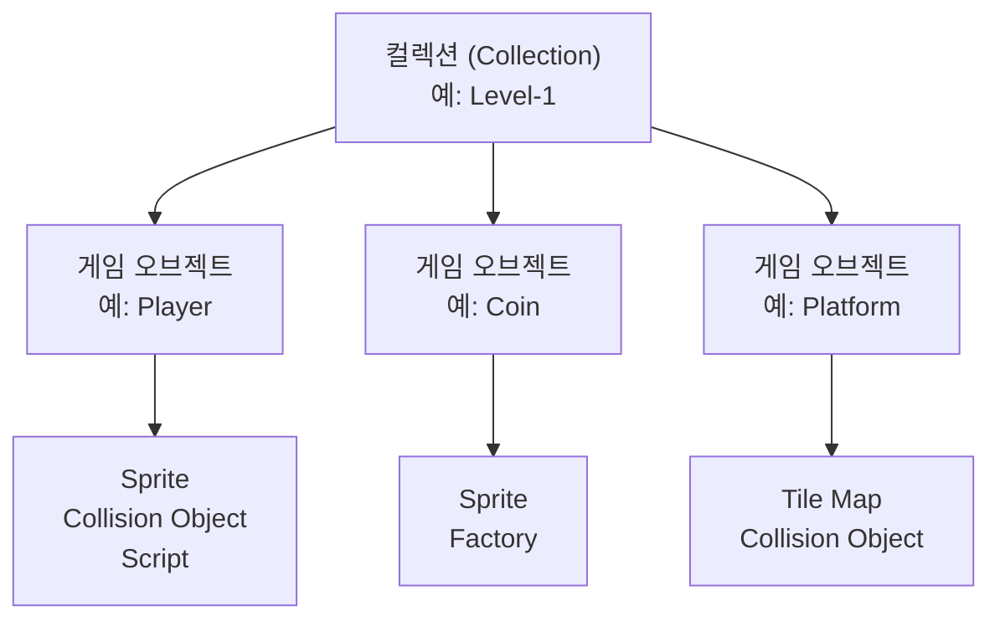
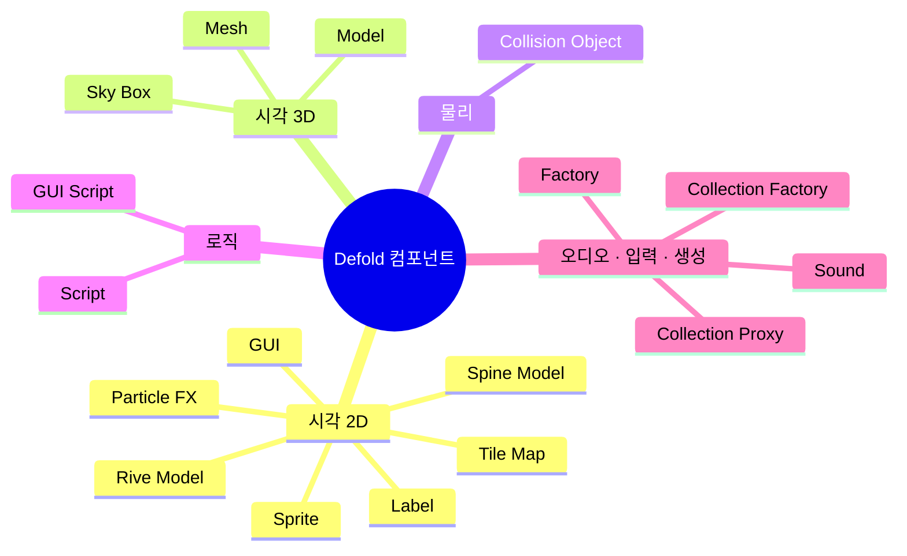
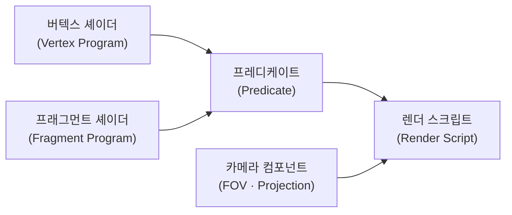
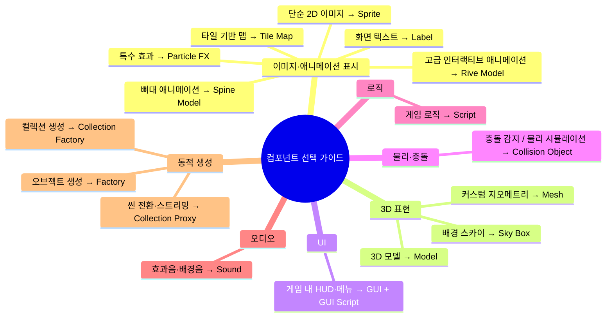

> **시리즈**: Defold 입문 — 2편: 컴포넌트 종류와 역할

## 개요

Defold는 다양한 기능을 바로 사용할 수 있는 빌트인 컴포넌트를 제공한다. 이 글에서는 각 컴포넌트가 무엇을 하는지, 언제 쓰는지를 정리한다. 세부 사용법은 이후 편에서 다루고, 여기서는 "무엇이 있는가"에 집중한다.

---

## 1. 복습: 게임 오브젝트와 컬렉션

1편의 내용을 간단히 짚고 넘어간다.

- **게임 오브젝트**: 고유 ID + 트랜스폼(위치·회전·스케일)을 가진 기본 단위
- **컴포넌트**: 게임 오브젝트에 부착하여 기능을 추가하는 단위
- **컬렉션**: 게임 오브젝트를 묶는 단위 (예: 지형, 코인, 장애물, 체크포인트가 포함된 레벨)



---

## 2. 컴포넌트 전체 지도

Defold의 컴포넌트는 역할에 따라 다섯 범주로 나눌 수 있다.



---

## 3. 2D 시각 컴포넌트

### Sprite

가장 기본적인 2D 비주얼 컴포넌트다.

- 단일 정적 프레임 또는 여러 프레임으로 구성된 애니메이션 지원
- 텍스처 소스로 **Atlas** 또는 **Tile Source** 중 하나를 지정

| 텍스처 소스 | 설명 |
|---|---|
| Atlas | 크기·모양이 다양한 이미지를 하나의 시트로 묶은 갤러리 |
| Tile Source | 동일한 크기의 정사각형 타일로 구성된 시트 |

### Tile Map

타일 기반 맵을 만드는 컴포넌트다.

- Tile Source를 기반으로 그리드 형태의 맵 구성
- Defold 내장 타일 맵 에디터 사용 가능
- 외부 도구(Tiled, Tile Setter 등)에서 제작 후 가져오기도 지원

### Spine Model

뼈대 기반 스켈레탈 애니메이션 컴포넌트다 (확장 기능으로 제공).

- 서로 연결된 이미지 세트(뼈대)에 애니메이션 적용
- **Spine** 또는 무료 대안인 **Dragon Bones**에서 제작한 씬을 임포트

### Rive Model

현대적인 웹 기반 애니메이션 도구 **Rive**에서 만든 애니메이션을 사용하는 컴포넌트다 (확장 기능, 개발 중).

Spine과 비교한 Rive의 특징:

| 기능 | Spine | Rive |
|---|---|---|
| 스켈레탈 애니메이션 | ✓ | ✓ |
| 메쉬 변형 | - | ✓ |
| 상태 머신 | - | ✓ |
| 역운동학(IK) | - | ✓ |
| 부드러운 상태 전환(보간) | - | ✓ |

### Particle FX

파티클 기반 특수 효과 컴포넌트다.

- 폭발, 불꽃, 흩뿌림, 궤적, 날씨 등 다양한 효과 구현 가능
- **이미터(Emitter)**: 파티클을 생성하는 주체 (모양, 방향, 속도 등 정의)
- **모디파이어(Modifier)**: 파티클의 움직임에 영향을 주는 힘 (중력, 방사력 등)
- **커브 에디터**: 파티클 생명주기 동안 속성 값을 곡선으로 세밀하게 제어
- Defold는 3D 엔진이므로 파티클을 3차원 공간에서도 방출 가능

### Label

텍스트를 화면에 표시하는 컴포넌트다.

- 폰트, 머티리얼, 색상, 그림자, 외곽선 설정 가능
- UI 텍스트보다 게임 오브젝트에 직접 붙이는 레이블에 적합

---

## 4. 3D 시각 컴포넌트

### Model

3D 메쉬와 애니메이션을 표시하는 컴포넌트다.

- 지원 포맷: **Collada(`.dae`)**, **glTF(`.gltf`/`.glb`)**
- 애니메이션 및 메쉬 속성 지정 가능

### Mesh

Model과 달리 여러 개의 메쉬를 가질 수 있고, 커스텀 버텍스 포맷을 지원하는 컴포넌트다. 프로시저럴 지오메트리 생성 등 자유도가 높은 3D 표현에 사용한다.

### Sky Box

6면 큐브 맵 텍스처를 사용해 배경 스카이박스를 생성하는 컴포넌트다.

---

## 5. 렌더링 파이프라인과 머티리얼

모든 시각 컴포넌트에는 **머티리얼(Material)** 을 지정할 수 있다. Defold의 렌더 파이프라인은 다음 요소로 구성된다.



- **커스텀 셰이더**: 버텍스 프로그램과 프래그먼트 프로그램으로 분리
- **렌더 스크립트**: 오브젝트의 렌더링 방식과 뷰 프로젝션 제어
- **카메라 컴포넌트**: 시야각(FOV), 프로젝션 타입 등의 속성으로 동적 제어 가능

---

## 6. GUI 컴포넌트

게임 내 사용자 인터페이스를 설계하는 전용 컴포넌트다.

세 가지 노드 타입만으로 다양한 UI를 구성할 수 있다.

| 노드 타입 | 용도 |
|---|---|
| Box | 이미지·배경·버튼 등 사각형 기반 요소 |
| Pie | 원형 게이지, 쿨다운 UI 등 |
| Text | 텍스트 표시 |

추가로 GUI 컴포넌트에서 지원하는 기능:

- **GUI Script**: 별도의 스크립트로 UI 로직 제어
- 텍스처: Atlas 및 Tile Source 지정 가능
- 레이어(Layer): 렌더링 순서 제어
- **레이아웃**: 가로/세로 방향에 따른 반응형 레이아웃 설정
- Spine·Rive 애니메이션, 파티클 효과 노드 삽입 가능

---

## 7. 물리 컴포넌트: Collision Object

충돌과 물리 시뮬레이션을 담당하는 컴포넌트다. 이름과 달리 충돌 감지뿐 아니라 물리 바디 전체를 정의한다.

**주요 설정 항목:**

- 소속 **그룹(Group)** 과 충돌할 **마스크(Mask)** 지정
- 내장 충돌 모양: Box, Sphere, Capsule
- 타일 맵의 타일 이미지에 맞는 충돌 모양 자동 생성 지원

**사용 물리 엔진:**

| 차원 | 엔진 |
|---|---|
| 3D | Bullet Physics |
| 2D | Box2D (수정 버전) |

---

## 8. 로직 컴포넌트: Script

게임 로직을 담는 컴포넌트다. **Lua** 언어로 작성한다.

```lua
function init(self)
    -- 초기화
end

function update(self, dt)
    -- 매 프레임 실행
end

function on_message(self, message_id, message, sender)
    -- 메시지 수신 처리
end

function on_input(self, action_id, action)
    -- 입력 처리
end

function final(self)
    -- 종료 처리
end
```

**Lua 모듈**을 작성하면 여러 스크립트에서 공통 로직을 라이브러리처럼 재사용할 수 있다.

---

## 9. 기타 컴포넌트

### Sound

오디오 재생과 제어를 담당하는 컴포넌트다. 배경음악, 효과음 등에 사용한다.

### 입력 바인딩 (Input Binding)

컴포넌트는 아니지만 입력 처리의 핵심 설정이다.

- 어떤 키/버튼/마우스/게임패드 입력이 어떤 **액션(Action)** 을 유발할지 지정
- 설정 파일에서 관리하며, Script의 `on_input()` 에서 해당 액션을 처리

### Factory

코드에서 게임 오브젝트를 **동적으로** 생성하는 컴포넌트다.

### Collection Factory

컬렉션 전체를 코드에서 동적으로 생성하는 컴포넌트다.

### Collection Proxy

컬렉션을 런타임에 로드·언로드하는 컴포넌트다. 씬 전환, 레벨 스트리밍 등에 사용한다.

---

## 정리



다음 글에서는 실제로 게임 오브젝트와 컴포넌트를 조합하여 간단한 게임을 만들어 본다.
