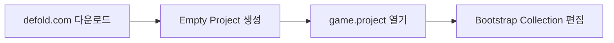
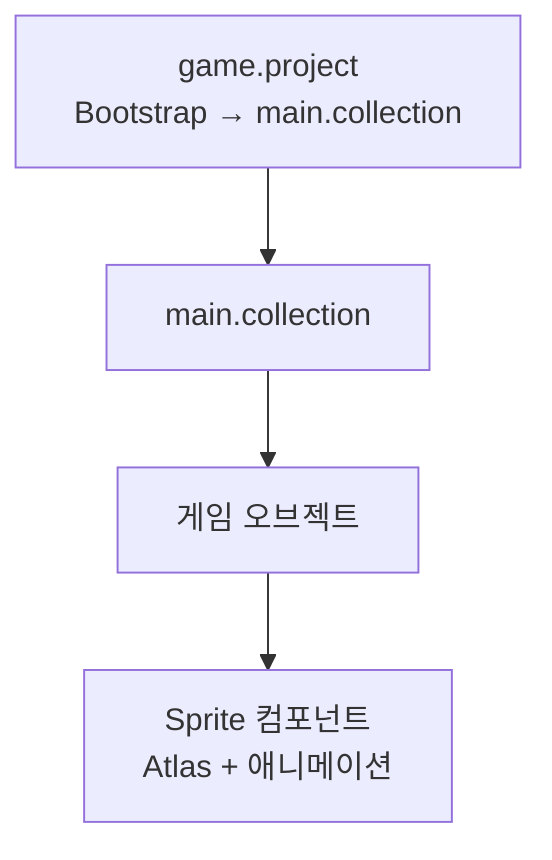
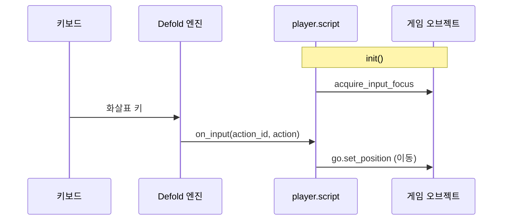
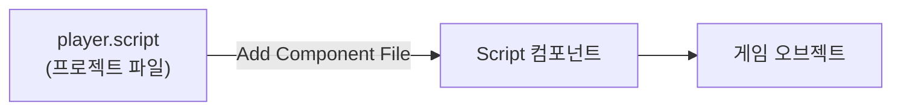
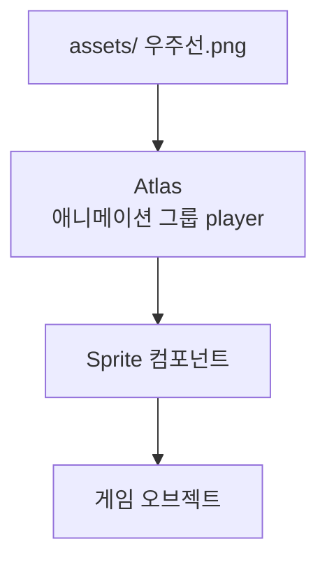
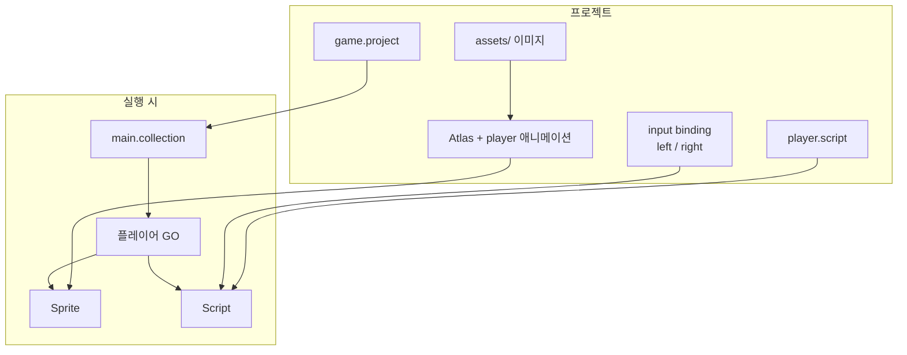

[원본 유튜브](https://youtu.be/HjJ-oDz-GcI?si=Lyo0PfdE6bUGiK7q)

> **시리즈**: Defold 입문 — 3편: 간단한 슈팅 게임 만들기 (1/2)  
> 이전: [1편 기본 구조](/posts/games/defold-1/) · [2편 컴포넌트 개요](/posts/games/defold-2/)

## 개요

갤러가·스페이스 인베이더 같은 고전 슈팅 게임은 게임 개발 입문에 적합하다. 이 글에서는 Defold로 **플레이어 우주선 하나를 화면에 띄우고, 좌우 화살표로 움직이게** 하는 것까지를 단계별로 진행한다. 적·충돌·총알은 다음 편에서 이어서 다룬다.

---

## 1. 설치와 새 프로젝트

[defold.com](https://defold.com/)에서 OS에 맞는 버전을 받는다. 압축을 풀고 실행하면 되며, 별도 설치 과정은 없다. Steam으로 받을 수도 있다.

에디터를 열고 **Empty Project** 템플릿으로 새 프로젝트를 만든 뒤 **Create New Project**를 클릭한다. 템플릿이 내려받아지면 편집기가 열린다.



---

## 2. Bootstrap과 첫 스프라이트 (Hello World)

`game.project`에서 프로젝트 이름 등 기본 설정을 확인한다. **Bootstrap** 탭의 **Bootstrap Collection**을 연다. 비어 있으면 여기서 씬을 구성한다.

1. 게임 오브젝트 추가
2. **Sprite** 컴포넌트 추가
3. 내장 이미지 소스 선택 → 기본 애니메이션 중 하나(예: 방사형 그라데이션 블롭) 지정
4. 게임 오브젝트를 약간 위·오른쪽으로 이동
5. 저장 후 빌드·실행

| 단축키 | 동작 |
|---|---|
| `F` | 선택한 컴포넌트에 뷰 맞추기 (View → Frame Selection) |
| `Ctrl/Cmd + S` | 저장 (탭 이름 옆 `*` = 미저장) |
| `Ctrl/Cmd + B` | 빌드·실행 |
| `Ctrl/Cmd + N` | 새 파일 생성 |

메뉴에서도 동일한 명령을 쓸 수 있으며, 메뉴 항목 옆에 단축키가 표시된다. 빌드는 **Project → Build**에서도 가능하다.

지금까지 한 일을 정리하면 다음과 같다.

- **main.collection**에 스프라이트가 붙은 게임 오브젝트 하나
- Properties에서 **Atlas**와 그 안의 **애니메이션(단일 프레임)** 선택
- 위치·회전·스케일 외에 **Material**, **Blend Mode** 등도 있으나 기본값 유지



> 컬렉션·게임 오브젝트에 바로 붙일 수 있는 컴포넌트도 있고, **Script**처럼 프로젝트에 **별도 파일**로 만든 뒤 연결해야 하는 것도 있다.

---

## 3. 스크립트 파일 만들기

플레이어 입력과 이동에는 **Script**가 필요하다.

**File → New** (`Ctrl/Cmd + N`) → **Script** 선택 → 이름 예: `player` → **Create Script**.  
또는 Assets 패널에서 우클릭 → **New → Script**.

생성된 스크립트에는 `init`, `final`, `update` 등 라이프사이클 함수가 기본으로 들어 있다. 이 튜토리얼에서는 **`init`** 과 **`on_input`** 만 남기고 나머지는 삭제해도 된다.

Defold 스크립트는 **Lua**로 작성한다. [Defold Lua API](https://defold.com/ref/stable/go/)와 [입력 처리](https://defold.com/manuals/input/) 문서를 함께 보면 좋다.

---

## 4. 입력 포커스와 `on_input`

스크립트가 키 입력을 받으려면, 해당 게임 오브젝트가 **입력 포커스**를 가져야 한다. `init`에서 다음을 호출한다.

```lua
function init(self)
    msg.post(".", "acquire_input_focus")
end
```

`.`은 **이 게임 오브젝트 자신**을 가리키는 URL 약어다. `"acquire_input_focus"` 메시지를내면 이후 `on_input`이 호출된다.



---

## 5. Input Binding과 `action_id` (해시)

`on_input`의 `action_id`는 **해시된 문자열**이다. 엔진이 문자열 비교 대신 숫자 ID로 동작을 구분하므로 효율적이며, Defold 입력 설계상 `action_id`는 해시로 다룬다.

프로젝트의 **input binding** 파일을 연다.

1. `+`로 트리거 추가
2. **Key Trigger**에서 `left` 선택 → 키보드 왼쪽 화살표에 매핑
3. **action_id**에 `left` 입력
4. 동일하게 `right` + 오른쪽 화살표 설정
5. 저장

| Input Binding | 스크립트에서 비교 |
|---|---|
| action_id: `left` | `action_id == hash("left")` |
| action_id: `right` | `action_id == hash("right")` |

스크립트에서 방향별 분기 예시:

```lua
function on_input(self, action_id, action)
    if action_id == hash("left") then
        -- 왼쪽 이동
    elseif action_id == hash("right") then
        -- 오른쪽 이동
    end
end
```

---

## 6. 게임 오브젝트 위치 이동 (GO API)

이동에는 **Game Object API** (`go.*`)를 쓴다.

1. `go.get_position()`으로 현재 위치를 테이블로 받는다
2. `x`를 줄이거나 늘린다
3. `go.set_position(pos)`로 반영한다

```lua
function on_input(self, action_id, action)
    if action_id == hash("left") then
        local pos = go.get_position()
        pos.x = pos.x - 0.1
        go.set_position(pos)
    elseif action_id == hash("right") then
        local pos = go.get_position()
        pos.x = pos.x + 0.1
        go.set_position(pos)
    end
end
```

저장 후 빌드하면 화살표로 우주선을 좌우로 움직일 수 있다. 아직 스크립트는 **파일만** 있고 게임 오브젝트에 **연결되지 않았다면** 아래 단계가 필요하다.

---

## 7. 스크립트를 컴포넌트로 연결

`main.collection`의 Outline에서 게임 오브젝트 우클릭 → **Add Component File** → `player.script` 선택 → OK.

저장(`Ctrl/Cmd + S`) 후 빌드(`Ctrl/Cmd + B`)하여 입력이 동작하는지 확인한다.



---

## 8. 커스텀 스프라이트: 에셋과 Atlas

내장 블롭 대신 우주선 이미지를 쓰려면 프로젝트에 에셋을 넣는다.

1. 프로젝트 폴더에 `assets` 디렉터리 생성 (이름은 자유)
2. 이미지를 드래그 앤 드롭 (직접 그리거나 [itch.io](https://itch.io/) 등에서 구할 수 있음)
3. **File → New → Atlas** 생성
4. Atlas Outline에서 **Add Animation Group**
5. ID를 `player` 등으로 변경, 재생 모드 예: **None** (단일 정지 프레임)
6. 애니메이션 우클릭 → **Add Images** → 우주선 이미지 선택

Atlas는 최적화를 위해 **2의 거듭제곱** 크기로 맞춰지는 경우가 많다. 지금은 신경 쓰지 않아도 된다.

`main.collection`으로 돌아가 스프라이트 Properties에서:

- **Image**: 방금 만든 Atlas
- **Default Animation**: `player` 애니메이션

저장 후 다시 빌드하면 커스텀 우주선이 보인다.



> **Assets 패널**은 OS의 프로젝트 폴더와 1:1로 맞는다. 탐색기에서 파일을 넣으면 에디터에 보이고, 에디터에서 넣으면 디스크에도 반영된다.

---

## 9. 이번 편에서 만든 것



| 단계 | 내용 |
|---|---|
| 씬 구성 | Bootstrap → `main.collection`에 게임 오브젝트 + Sprite |
| 에디터 | 저장·빌드·뷰 맞추기 단축키 |
| 로직 | `player.script` — `init`, `on_input`, `go.get/set_position` |
| 입력 | Input binding + `hash("left")` / `hash("right")` |
| 그래픽 | Atlas에 애니메이션 그룹 → 스프라이트에 연결 |

---

## 다음 편 예고

다음 글에서는 같은 프로젝트를 이어서 **적**, **충돌 오브젝트**, **총알**을 추가하고 액션이 있는 게임플레이 루프를 만든다.

---

## 참고

- [Defold — Getting Started](https://defold.com/manuals/introduction/)
- [Defold — Input](https://defold.com/manuals/input/)
- [go.* API](https://defold.com/ref/stable/go/)
