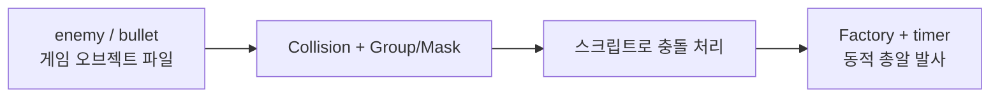
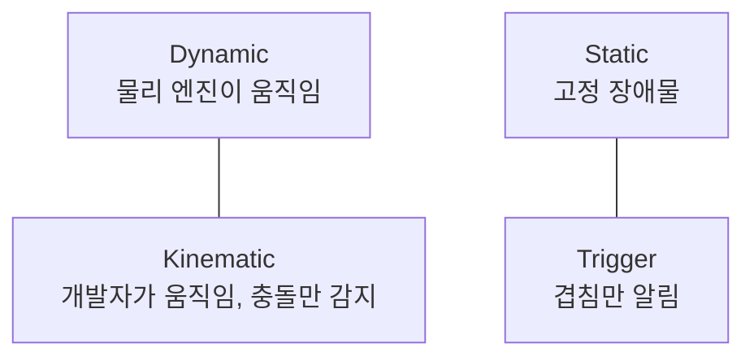
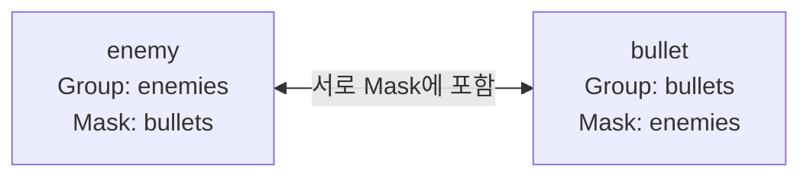
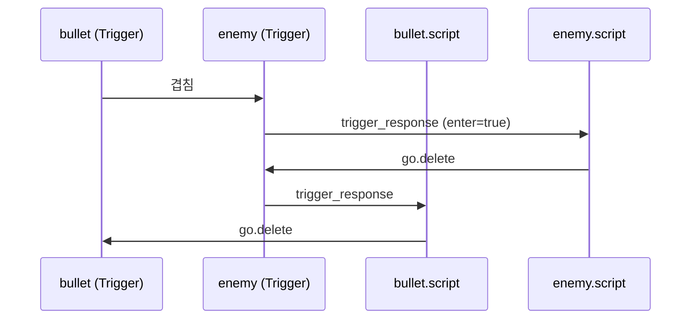
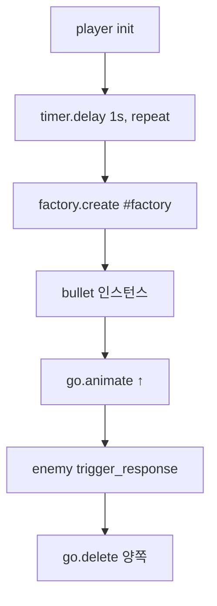
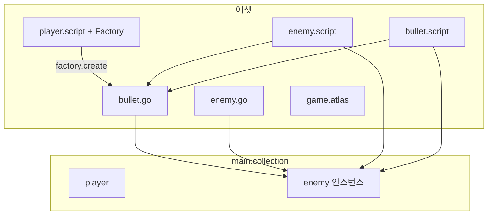

[원본 유튜브](https://youtu.be/CcgunSGKkYE?si=wRW9H8qzSFMz445X)

> **시리즈**: Defold 입문 — 4편: 간단한 슈팅 게임 만들기 (2/2)  
> 이전: [3편 플레이어 이동](/posts/games/defold-3/) · [1편](/posts/games/defold-1/) · [2편](/posts/games/defold-2/)

## 개요

[3편](/posts/games/defold-3/)에서 만든 프로젝트를 이어서 **적 우주선**, **총알**, **충돌 감지**, **팩토리로 동적 생성**까지 구현한다. 스페이스 인베이더·갤러그·Warblade에서 영감을 받은 2D 슈팅의 핵심 루프를 완성하는 단계다.

충돌·팩토리만 배우고 싶다면 새 Empty Project에서도 동일한 절차를 따를 수 있다.



---

## 1. 적 게임 오브젝트 (프로토타입)

3편에서는 `main.collection` 안에 플레이어를 직접 만들었다. **팩토리**로 런타임에 생성하려면, 먼저 **게임 오브젝트 파일**(`.go`)이 필요하다. 이 파일이 **프로토타입** 역할을 한다.

1. Assets에서 **Game Object** 파일 추가 → 이름 예: `enemy`
2. Sprite 컴포넌트 추가
3. Atlas에 적 이미지 추가 후 연결

### Atlas에 `enemy` 애니메이션 추가

1. `assets/`에 적 우주선 이미지 드래그 앤 드롭
2. `game.atlas` 편집 → **Add Animation Group**
3. ID: `enemy`, 재생 모드: **None**
4. **Add Images**로 적 이미지 지정
5. `enemy` 게임 오브젝트의 스프라이트에 Atlas + `enemy` 애니메이션 설정

---

## 2. Collision Object 컴포넌트

총알이 적에 맞았는지 알려면 **Collision Object** 컴포넌트를 쓴다. 이름이 “오브젝트”처럼 들리지만 **컴포넌트**가 맞다.

Outline에서 게임 오브젝트 루트 우클릭 → **Add Component → Collision Object**.

- **Collision Shape**: Box 등 기본 도형 추가, 스프라이트를 대략 덮도록 크기 조절
- 편집 단축키: `W`(이동), `E`(회전), `R`(크기). 하단 툴바 아이콘으로도 전환 가능

### 충돌 타입 4가지

Defold(및 많은 엔진)의 충돌 오브젝트는 네 가지 타입 중 하나다.

| 타입 | 동작 | 적합한 용도 |
|---|---|---|
| **Dynamic** | Box2D(2D) / Bullet(3D)가 완전 시뮬레이션. 힘·토크·감쇠·속도로만 제어 | 공 떨어짐, 핀볼, Angry Birds 등 |
| **Kinematic** | 충돌은 처리하지만 다른 것에 밀리지 않음. 충돌 메시지로 정보를 받고 스크립트에서 위치·회전 제어 | 플랫포머 주인공 등 “코드로 움직이는” 캐릭터 |
| **Static** | 절대 안 움직임. 다른 오브젝트가 부딪힘 | 벽, 바닥, 고정 지형 |
| **Trigger** | 물리 반응 없음. 겹침만 감지 → 메시지 전달 | 구역 진입, 이벤트, **총알 맞음** |



이 슈팅 게임에서는 **맞았는지 여부만** 필요하므로 양쪽 모두 **Trigger**를 쓴다. 레이캐스트는 “읽기만” 하는 또 다른 도구로, 나중에 별도로 다룰 만하다.

---

## 3. Group과 Mask

충돌이 **언제** 일어나는지는 **Group**과 **Mask** 쌍으로 정한다.

- **Group**: 이 충돌 오브젝트가 속한 그룹 ID (Unity 태그와 유사)
- **Mask**: 쉼표로 구분한 그룹 목록 — **이 그룹들과만** 상호작용



### 적 (`enemy`)

- Collision Object 타입: **Trigger**
- **Group**: `enemies`
- **Mask**: `bullets`

### 총알 (`bullet`)

게임 오브젝트 파일 `bullet`을 같은 방식으로 만든다.

1. Sprite → Atlas의 SF 발사체 이미지
2. Collision Object → Box 모양, 크기 조절
3. 타입: **Trigger**
4. **Group**: `bullets`
5. **Mask**: `enemies` (적과 반대로 설정 → 총알↔적만 충돌)

---

## 4. main.collection에서 충돌 테스트

팩토리 적용 전에 **씬에 직접 배치**해 동작을 확인한다.

1. `main.collection`에 `enemy`, `bullet` 인스턴스 추가 (또는 프로토타입을 끌어다 놓기)
2. 플레이어 위쪽에 적, 그 사이에 총알 배치
3. 빌드 후 겹침·스크립트 동작 확인 (이후 총알은 팩토리로만 생성)

---

## 5. 총알 스크립트: 위로 이동

`bullet.script` 생성 후 `init`에서 Y축으로 애니메이션한다.

```lua
function init(self)
    go.animate(".", "position.y", go.PLAYBACK_ONCE_FORWARD, 500, 0, 0, nil)
end
```

`go.animate` 인수(재생 모드, 목표값, 시간 등)는 Properties와 문서를 보며 조정한다. 스크립트를 bullet 게임 오브젝트에 **Add Component File**로 연결하고, 총알이 위로 날아가는지 확인한다.

---

## 6. 적 스크립트: `trigger_response` 처리

Trigger가 겹치면 **`trigger_response`** 메시지가 온다. `on_message`에서 처리한다.

```lua
function on_message(self, message_id, message, sender)
    if message_id == hash("trigger_response") then
        if message.enter then
            go.delete(".")
        end
    end
end
```

- `message.enter == true`: 다른 충돌 오브젝트가 **트리거 영역에 들어옴**
- `go.delete(".")`: 이 게임 오브젝트(적) 삭제

적 스크립트를 연결한 뒤, 총알이 닿으면 적이 사라지는지 확인한다.

### 총알도 삭제

같은 `trigger_response` 처리를 **bullet.script**에도 넣으면, 맞은 뒤 총알도 제거된다. 작은 튜토리얼에서는 코드 중복이 있어도 괜찮다. 탄막 슈팅처럼 총알이 많아지면 **총알 전용 매니저 스크립트 하나**에서 일괄 처리하는 편이 낫다.



---

## 7. Factory로 총알 동적 생성

`main.collection`에 고정해 둔 총알은 제거한다. 플레이어가 **발사**하도록 **Factory** 컴포넌트를 추가한다.

1. `player` 게임 오브젝트에 **Factory** 컴포넌트 추가
2. **Prototype**: `bullet` 게임 오브젝트 파일 선택
3. `player.script`에서 생성:

```lua
factory.create("#factory")
```

`#factory`는 **현재 게임 오브젝트의 factory 컴포넌트**만 가리키는 상대 URL이다. `#`은 컴포넌트 주소임을 Defold에 알린다.

빌드 후 총알이 생성되는지 확인하고, 씬에 있던 정적 총알 인스턴스는 삭제한다.

---

## 8. 타이머로 1초마다 발사

`timer.delay`로 반복 발사를 넣는다.

```lua
function init(self)
    msg.post(".", "acquire_input_focus")

    timer.delay(1, true, function()
        factory.create("#factory")
    end)
end
```

| 인수 | 의미 |
|---|---|
| `1` | 지연·간격(초) |
| `true` | 반복 |
| `function() ... end` | 매 틱마다 호출되는 콜백 (Lua 익명 함수) |

콜백 안에 `factory.create("#factory")`를 두면 **1초마다 총알**이 나간다. `main.collection`에 적 인스턴스를 더 넣으면 간단한 슈팅 플레이를 바로 체험할 수 있다.



---

## 9. 이번 편에서 만든 것

| 항목 | 내용 |
|---|---|
| 프로토타입 | `enemy.go`, `bullet.go` — 팩토리·재사용 단위 |
| Atlas | `enemy` 애니메이션 그룹 |
| Collision | Trigger + Group/Mask (`enemies` ↔ `bullets`) |
| 스크립트 | `go.animate`, `on_message` + `trigger_response`, `go.delete` |
| 동적 생성 | Factory + `factory.create("#factory")` |
| 타이머 | `timer.delay`로 자동 발사 |



---

## 다음 편 예고

다음에는 **이펙트**, **점수를 추적하는 UI** 등을 추가해 게임을 다듬는다.

---

## 참고

- [Collision objects](https://defold.com/manuals/physics/)
- [Factory](https://defold.com/manuals/factory/)
- [timer.* API](https://defold.com/ref/stable/timer/)
- [factory.* API](https://defold.com/ref/stable/factory/)
- [go.animate](https://defold.com/ref/stable/go/#go.animate)
