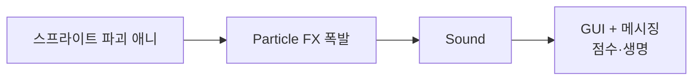
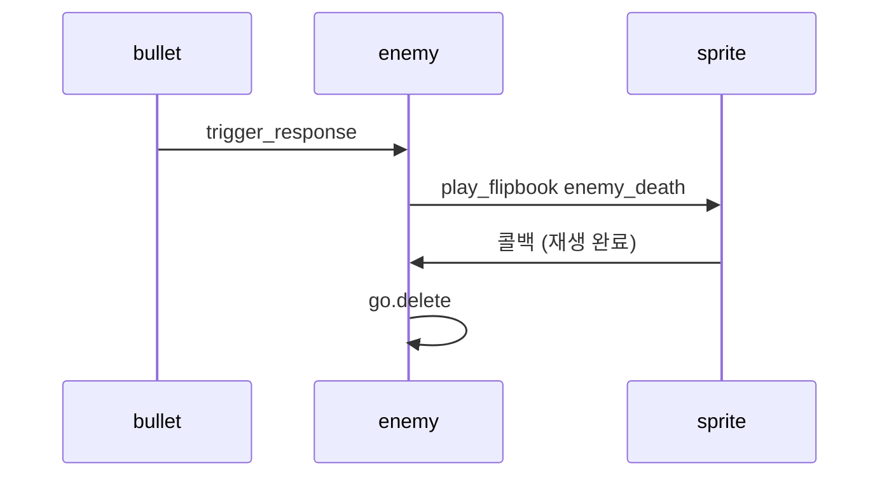
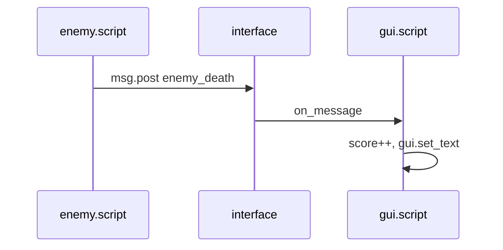
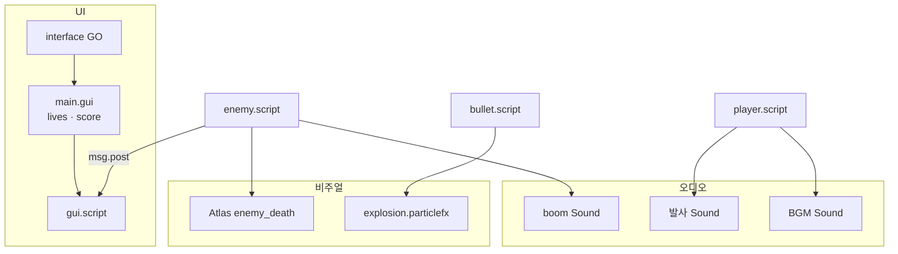

[원본 유튜브](https://youtu.be/4r-L51jen_I?si=TKVRLk_W7OY889hW)

> **시리즈**: Defold 입문 — 5편: 슈팅 게임 마무리 (이펙트·UI)  
> 이전: [4편 적·충돌·팩토리](/posts/games/defold-4/) · [3편](/posts/games/defold-3/) · [1편](/posts/games/defold-1/) · [2편](/posts/games/defold-2/)

## 개요

[4편](/posts/games/defold-4/)까지 만든 프로토타입은 비행·발사·격추가 되지만, 아직 “게임” 느낌은 부족하다. 이 글에서는 **파괴 애니메이션**, **파티클**, **사운드**, **GUI·점수**를 붙여 갤러그 스타일 클론을 한 단계 다듬는다.



---

## 1. 적 파괴 스프라이트 애니메이션

Atlas에 **전체 프레임 시퀀스**를 넣는다 (예: `enemy_death`).

1. **Add Animation Group** → ID: `enemy_death`
2. **Add Images**로 모든 프레임 추가
3. Outline에서 **Alt + ↑/↓**로 재생 순서 조정, 필요 시 프레임 복제
4. 재생 모드: **한 번만 앞으로** (Once Forward)
5. **FPS** 조정 후 `Space`로 미리보기

4편에서는 충돌 시 바로 `go.delete` 했다. 이제 **애니메이션 재생 후** 삭제한다.

```lua
function on_message(self, message_id, message, sender)
    if message_id == hash("trigger_response") then
        if message.enter then
            sprite.play_flipbook("#sprite", "enemy_death", function()
                go.delete(".")
            end)
        end
    end
end
```

- `sprite.play_flipbook`: 스프라이트 컴포넌트(`#sprite`)에서 Atlas 애니메이션 재생
- **세 번째 인수(콜백)**: 재생이 끝난 뒤에만 호출 — **Once** 모드에서만 동작
- `go.delete(".")`를 콜백 안으로 옮겨, 재생 중 조기 삭제를 막는다



---

## 2. 파티클 폭발 (Particle FX)

**Particle FX**는 전용 에디터 뷰와 **커브 에디터**(하단)를 갖는 컴포넌트다. 파티클 수명 동안 속성을 곡선으로 애니메이션할 수 있다.

### 리소스 만들기

1. Assets → **Particle FX** 추가 (예: `explosion`)
2. 에디터에서 `Space`로 방출 시작/정지
3. 이미터 타입 예: **Sphere**
4. 속성을 바꿔 보며 감을 익힌다

### 폭발에 맞는 설정 요약

| 항목 | 권장 |
|---|---|
| 초기 속도 | 낮춤 (밀도감) |
| 수명 | 짧게 |
| 재생 모드 | **Once**, 지속 시간 매우 짧게 |
| Emission Space | **World** (총알 삭제 후에도 월드에 파티클 유지) |
| Spawn rate | 약간 상향 (최대 파티클 128 한도 참고) |
| 색상 | 녹/파랑 낮춰 빨강·주황 톤 |
| Life Color / Life Alpha | 커브 에디터로 수명 끝에서 페이드아웃 |

커브 에디터: 값 옆 버튼 → 곡선 추가. 휠 확대/축소, 가운데 버튼으로 패닝. Life Alpha는 0=시작, 1=끝(정규화).

### bullet에 연결

1. `bullet` 게임 오브젝트 → **Add Component File** → `explosion` 파티클 FX
2. `bullet.script` 충돌 처리 부분에 추가:

```lua
particlefx.play("#explosion")
```

`Space`로 스케일이 적절한지 확인한 뒤, 적 명중 시 폭발이 나오는지 테스트한다.

---

## 3. 총알이 적을 빗나갈 때 삭제

적에 맞지 않은 총알이 화면 위로 계속 쌓이는 문제를 고친다. `go.animate`의 **완료 콜백**을 쓴다.

```lua
function init(self)
    go.animate(".", "position.y", go.PLAYBACK_ONCE_FORWARD, 500, 0, 0, function()
        go.delete(".")
    end)
end
```

- 인수 순서: 목표, 시간, **delay**(기본 0) 등 — 문서와 에디터 힌트 참고
- 콜백 안에서 `go.delete(".")` — 인자 생략 시 **이 스크립트가 붙은 게임 오브젝트** 삭제

맞았을 때는 충돌 처리에서 삭제하고, 빗나갔을 때는 애니메이션 종료 후 삭제한다.

---

## 4. 사운드

WAV 등을 `assets/`에 넣고 **Sound** 타입 리소스 컴포넌트를 만든다.

### 폭발음 (`boom`)

1. **Sound** 컴포넌트 → `boom`, 사운드 리소스 지정
2. `enemy` 게임 오브젝트에 **Add Component File**
3. 파괴 시점 스크립트:

```lua
sound.play("#boom")
```

| 속성 | 설명 |
|---|---|
| Group | SFX / BGM 등 묶음 볼륨 제어 |
| Gain | 0~1 볼륨 |
| Pan | -1(왼쪽) ~ +1(오른쪽) |
| Speed | 재생 속도 (0.5 = 절반, 2 = 2배) |

### 발사음 (플레이어)

레트로 총소리 Sound 컴포넌트를 `player`에 추가하고, `factory.create` 직전·직후에 `sound.play("#...")` 호출.

### 배경음악

Sound 컴포넌트에서 **반복 재생**, 반복 횟수 **0** = 무한 반복. `player.script`의 `init`에서:

```lua
sound.play("#music")
```

복잡한 게임에서는 전용 “오디오 매니저” 게임 오브젝트에 BGM을 두는 경우가 많다.

---

## 5. GUI 컴포넌트

Defold **GUI**는 게임 화면 위에 그리는 UI 레이어다.

1. **GUI** 리소스 생성 → 이름 예: `main`
2. 흰 프레임 = 게임 창. Outline에서 노드 추가:

| 노드 | 용도 |
|---|---|
| **Box** | 직사각형 (생명 아이콘 등), 텍스처·Manual/Auto Size |
| **Text** | 문자열 (점수) |
| Pie / Template / Particle FX | 기타 |

### 설정 순서

1. GUI 루트 **Texture**: `game.atlas`
2. Box → 우주선 텍스처, 구석 배치
3. **Text** 노드를 Box **자식**으로 두면 부모 이동 시 함께 이동
4. GUI **Font**: 내장 시스템 폰트 등 지정 → Text 노드에도 폰트 선택
5. 반대쪽 구석에 점수용 Text 추가
6. 노드 ID: `lives`, `score` (코드에서 구분)

### 씬에 붙이기

`main.collection`에 `interface` 게임 오브젝트 추가 → **Add Component File** → `main.gui`.

---

## 6. GUI 스크립트와 메시징

GUI 전용 스크립트는 일반 스크립트와 비슷하지만 **gui.* API**를 쓴다.

1. Assets → **GUI Script** 추가
2. GUI `main` 루트 속성에서 해당 스크립트 지정
3. `on_message`만 남기고 디버그:

```lua
function on_message(self, message_id, message, sender)
    print("Hello!")
end
```

### 적 → GUI로 메시지

`enemy.script` 파괴 처리에서:

```lua
msg.post("/interface#main", "enemy_death")
```

- `/interface`: 게임 오브젝트 ID
- `#main`: GUI 컴포넌트 이름
- `"enemy_death"`: `message_id` (나중에 lives 등과 구분)

빌드 후 적 격추 → 콘솔에 출력되면 수신 성공.



### 점수 표시

```lua
local score = 0

function on_message(self, message_id, message, sender)
    if message_id == hash("enemy_death") then
        score = score + 1
        local node = gui.get_node("score")
        gui.set_text(node, score)
    end
end
```

- `gui.get_node("score")`: Outline에 지정한 텍스트 노드 ID
- `gui.set_text(node, score)`: 숫자는 자동으로 문자열 변환

`enemy.script`의 `message_id`와 GUI의 `hash("enemy_death")`를 **동일하게** 맞춘다.

---

## 7. 연습 과제 (시리즈 마무리)

튜토리얼에서 다루지 않은 확장:

| 과제 | 힌트 |
|---|---|
| 적이 플레이어 방향으로 발사 | 적 Factory + bullet 프로토타입 |
| 플레이어 피격 시 생명 감소 | `msg.post` → GUI, `lives` 노드 |
| 생명 0 | 게임 오버 UI, 재시작 버튼 |
| 적 AI·움직임·업그레이드 | 1~4편에서 익힌 GO·Factory·Script 확장 |

이 시리즈로 **기본 갤러그 클론** 골격은 갖춰졌다. 이후는 문서·예제·커뮤니티를 참고해 깊이를 더하면 된다.

---

## 8. 이번 편에서 만든 것



| 항목 | API / 리소스 |
|---|---|
| 파괴 애니 | `sprite.play_flipbook` + 완료 콜백 |
| 폭발 | `particlefx.play`, World emission |
| 총알 정리 | `go.animate` 완료 콜백 → `go.delete` |
| 사운드 | `sound.play`, 반복·Gain·Group |
| UI | `gui.get_node`, `gui.set_text` |
| 통신 | `msg.post("/interface#main", ...)` |

---

## 참고

- [Particle FX](https://defold.com/manuals/particlefx/)
- [Sounds](https://defold.com/manuals/sound/)
- [GUI](https://defold.com/manuals/gui/)
- [Messaging](https://defold.com/manuals/message-passing/)
- [sprite.* API](https://defold.com/ref/stable/sprite/)
- [gui.* API](https://defold.com/ref/stable/gui/)
- [Defold 포럼](https://forum.defold.com/) · [Discord](https://www.defold.com/discord/)
