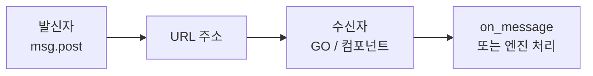
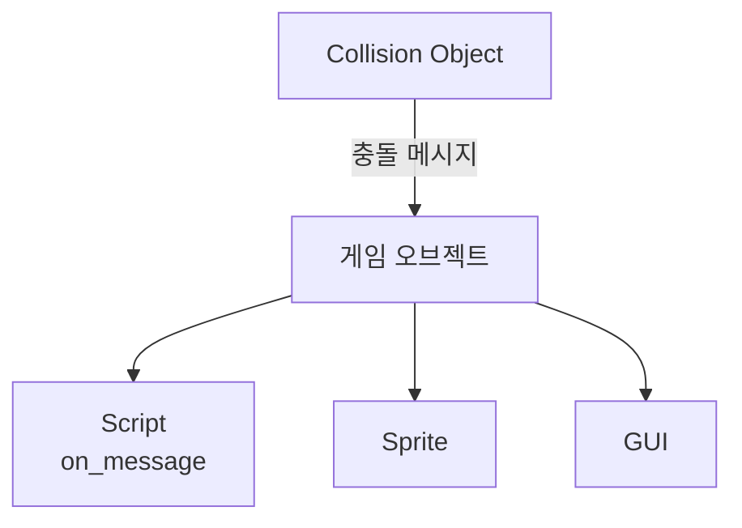
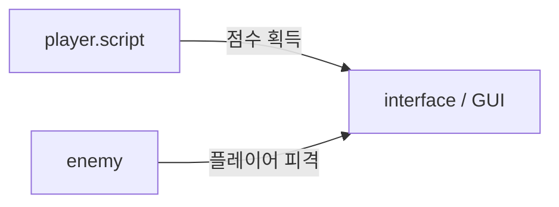
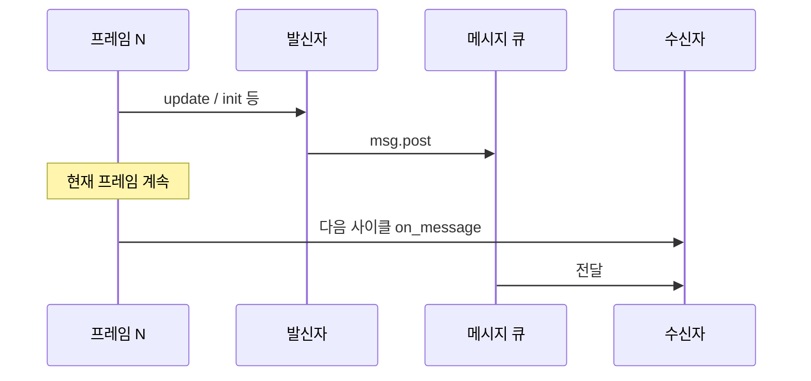
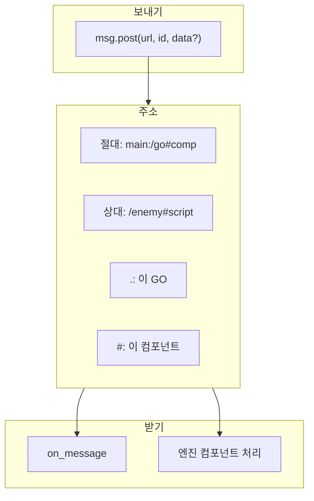

> **시리즈**: Defold 입문 — 6편: 메시징·주소 지정  
> 실습 예: [5편 GUI·점수](/posts/games/defold-5/) · [1편 기본 구조](/posts/games/defold-1/)

## 개요

게임 오브젝트와 시스템이 **강하게 묶이지 않고** 통신하려면 메시징이 핵심이다. Defold는 **주소가 정해진 봉투(메시지)** 를 보내는 방식으로 이벤트 기반·구독형 설계의 기반을 제공한다. 동시에 런타임에 생성된 모든 게임 오브젝트·컴포넌트에 **언제 어디서든** 접근할 수 있는 주소 지정이 필수다.

이 글은 [1편](/posts/games/defold-1/)의 게임 오브젝트·컴포넌트 개념을 알고 있다고 가정한다.



---

## 1. 메시지란 무엇인가

런타임의 모든 것은 **컴포넌트를 가진 게임 오브젝트 인스턴스**다. 메시징은 그 인스턴스들이 서로 말하게 해 주는 통로다.

| 요소 | 역할 |
|---|---|
| **주소(URL)** | 누가 받을지 |
| **message_id** | 어떤 종류의 메시지인지 |
| **message (테이블)** | 선택적 데이터 페이로드 |

편지에 담기는 내용처럼 숫자·문자열·불리언·해시·URL·중첩 테이블 등 Lua 값을 실을 수 있다.

---

## 2. 누가 메시지를 받는가

### 게임 오브젝트 vs 컴포넌트

- **게임 오브젝트 주소**로내면 → 그 GO에 붙은 **모든 컴포넌트**가 같은 메시지를 받는다.
- **컴포넌트 주소**(`#이름`)로내면 → **해당 컴포넌트만** 받는다.

수신 가능한 컴포넌트 예: Script, Collision Object, Sprite, Tile Map, GUI, Sound, Factory 등.

### 컴포넌트가 보내는 메시지

일부 컴포넌트는 **게임 오브젝트로** 메시지를 보낸다. 예: Collision Object가 `contact_point_response`, `trigger_response` 등을 GO에 전달하고, 같은 GO의 **Script**가 `on_message`에서 처리한다.



렌더 스크립트·카메라 등 **시스템**에도 메시지를 보낼 수 있다(포스트 프로세싱, 투영 변경 등).

---

## 3. `on_message`와 엔진 메시지

Script 컴포넌트는 `on_message(self, message_id, message, sender)`로 추가 로직을 작성한다. 엔진이 적절한 사이클에 **자동 호출**한다.

**내장 message_id 예:**

| message_id | 출처 |
|---|---|
| `contact_point_response` | 충돌 — 접촉점, 상대, 속도·충격량 등 |
| `trigger_response` | Trigger 충돌 — `enter` 등 ([4편](/posts/games/defold-4/)) |
| `animation_done` | Sprite — 비반복 애니메이션 완료 |

`message` 테이블 내용은 메시지마다 다르다. **데이터가 없는 메시지**에 필드를 무조건 읽으면 오류가 난다. `if message.foo then`처럼 방어적으로 다루고, 인터페이스를 일관되게 유지하는 것이 좋다.

```lua
function on_message(self, message_id, message, sender)
    if message_id == hash("contact_point_response") then
        -- message.position, message.normal, ...
    elseif message_id == hash("enemy_death") then
        -- 커스텀 메시지 ([5편](/posts/games/defold-5/))
    end
end
```

---

## 4. 메시지 보내기: `msg.post`

```lua
msg.post(receiver_url, message_id, optional_message_table)
```

| 인수 | 설명 |
|---|---|
| `receiver_url` | 수신 대상 URL (문자열 또는 `msg.url`) |
| `message_id` | 식별자 (문자열 → 내부적으로 hash) |
| `optional_message_table` | 선택 데이터 |

예 — GUI에 점수 이벤트 알리기 ([5편](/posts/games/defold-5/)과 동일 패턴):

```lua
msg.post("/interface#main", "enemy_death", { points = 100 })
```

---

## 5. 느슨한 결합 예: 플레이어 · GUI · 적



- 플레이어가 적을 격추 → GUI에 메시지 → 점수 갱신·화면 표시
- 적이 플레이어 공격 → GUI에 메시지 → 체력 UI 갱신

**플레이어 스크립트는 점수·체력 UI 구현을 알 필요가 없다.** “이벤트가 났다”만 알리면 된다. 이 분리가 수정·확장을 쉽게 한다.

---

## 6. URL 구조: 절대 주소

절대 URL은 **소켓 : 경로 / 프래그먼트 #** 순으로 읽는다.

```
main:/interface#main
│     │           └── 프래그먼트: 컴포넌트 ID (없으면 GO 전체)
│     └── 경로: 컬렉션 내 게임 오브젝트 ID
└── 소켓: 컬렉션(게임 월드·컨텍스트) ID
```

| 기호 | 의미 |
|---|---|
| `:` | 컬렉션(소켓) 구분 |
| `/` | 게임 오브젝트(경로) 시작 |
| `#` | 컴포넌트(프래그먼트) 시작 |
| `@` | 내장 시스템 (예: 렌더) |

같은 **게임 오브젝트 ID**는 **다른 컬렉션**에서도 재사용할 수 있다. 소켓이 다르면 다른 인스턴스다.

### `msg.url`로 조립

```lua
-- 문자열 한 번에
local url = msg.url("main:/interface#main")

-- 부분 지정
local url = msg.url("main", "/interface", "#main")

-- 빈 url → 이 컴포넌트가 생성된 컨텍스트의 "현재" 주소
local url = msg.url()
```

Outline에 보이는 **ID**가 런타임 식별자다. **파일 이름과는 무관**하다.

---

## 7. 상대 주소와 단축 표기

### 같은 컬렉션(같은 맥락)

컬렉션 식별자를 생략하고 **경로 + 프래그먼트**만 쓸 수 있다.

```lua
-- 같은 main 컬렉션 안에서 적의 controller 스크립트로
msg.post("/enemy#controller", "damage")
```

같은 스크립트를 다른 레벨 컬렉션에 복사해도, **그 레벨 안**의 `enemy`끼리는 동일 코드로 통신할 수 있다.

### 자기 자신·현재 컴포넌트

| 표기 | 의미 |
|---|---|
| `"."` | **이 게임 오브젝트** (모든 컴포넌트에 분배) |
| `"#"` | **이 스크립트 컴포넌트** (보낸 스크립트로 회신) |
| `"#sprite"` | 이 GO의 `sprite` 컴포넌트 |

[3편](/posts/games/defold-3/)의 `msg.post(".", "acquire_input_focus")`가 대표적이다.

### 범용 오디오·이펙트 GO

사운드·파티클 전용 GO 하나에 컴포넌트를 모아 두고, 여러 오브젝트가 같은 URL로 `sound.play` 대신 **메시지**로 재생을 요청하면 중복 리소스를 줄일 수 있다.

```lua
msg.post("/audio_manager#sound", "play_sfx", { name = "explosion" })
```

---

## 8. 메시지는 “지금” 실행되지 않는다

메시지는 **함수 직접 호출(콜백)** 이 아니다. 보낸 순간 수신자의 `on_message`가 같은 줄에서 돌아가지 않는다.



- **장점**: 한 프레임을 메시지 처리로 과도하게 막지 않음
- **init에서 post**: 다른 GO의 `init`이 끝난 뒤 전달 → 이미 초기화된 대상에 안전하게 보낼 수 있음
- **즉시성이 필요할 때**: 격투 게임 한 프레임 타이밍 등은 `msg.post` 대신 **sprite.play_flipbook**, `go.set_position` 같은 **API 직접 호출**을 고려

---

## 9. 런타임 생성과 컬렉션에 대한 이해

### Factory / Collection Factory

에디터에 ID가 없는 동적 인스턴스는 생성 **반환값**으로 주소를 얻는다.

```lua
local id = factory.create("#factory")           -- 생성된 GO id
local ids = collectionfactory.create("#cf")  -- 컬렉션 내 GO id 테이블
```

이후 `msg.post`에 그 id를 경로로 사용할 수 있다.

### “컬렉션”과 URL 소켓

에디터의 **컬렉션**은 런타임에 그대로 있는 구조물이 아니다. **무엇을 생성할지·계층·부모-자식**을 정의하는 편집 단위다.

URL의 **소켓(콜론 앞)** 은 “어느 게임 월드·컨텍스트인가”를 가리키는 식별자로 이해하면 된다. 튜토리얼에서는 컬렉션 ID와 1:1로 맞춰 설명해도 되지만, 런타임에는 **컨텍스트/네임스페이스**에 가깝다.

---

## 10. ECS·대규모 게임과의 관계

메시징 + 주소 지정은 **느슨한 ECS 스타일**에 잘 맞는다.

- 수천 발의 탄막·적: 이벤트만 broadcast하거나 특정 매니저 GO로 모음
- 수백 유닛 전략: 동일 스크립트 + 상대 주소로 레벨 간 재사용

성능 면에서도 메시지 전달은 가볍게 설계되어, 많은 오브젝트가 실시간으로 통신하는 게임에도 쓸 만하다.

---

## 11. 정리

| 주제 | 핵심 |
|---|---|
| 메시지 | URL + message_id + 선택 테이블 |
| 수신 | GO 전체 vs `#컴포넌트` |
| Script | `on_message` + 엔진/커스텀 ID |
| 절대 URL | `소켓:/경로#프래그먼트`, 시스템은 `@` |
| 상대 URL | 같은 컬렉션·같은 GO 안에서 생략·단축 |
| 타이밍 | 다음 사이클 처리, init 안전성 |
| 동적 생성 | `factory.create` 반환 id |



Defold 메시징·주소 지정은 처음엔 기호(`:`, `/`, `#`, `.`)가 헷갈리지만, **Outline ID**와 **맥락(같은 컬렉션 vs 다른 컬렉션)** 만 익숙해지면 [5편](/posts/games/defold-5/)처럼 GUI·게임플레이를 깔끔하게 나누는 데 큰 도움이 된다.

---

## 참고

- [Message passing](https://defold.com/manuals/message-passing/)
- [Addresses](https://defold.com/manuals/addressing/)
- [msg.* API](https://defold.com/ref/stable/msg/)
- [on_message](https://defold.com/ref/stable/script/#on_message)
